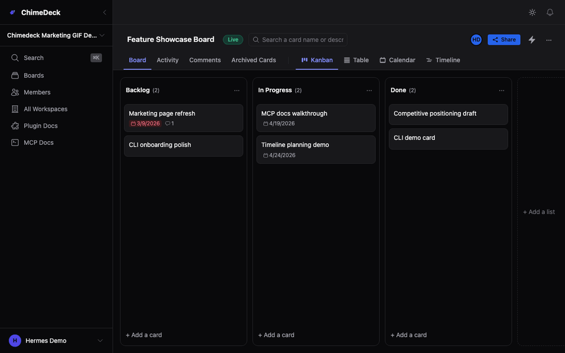
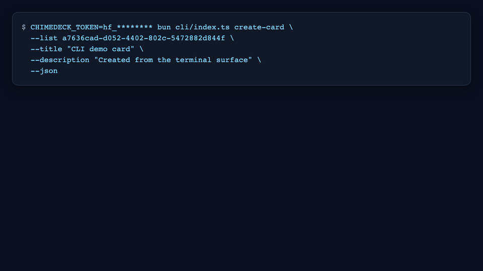
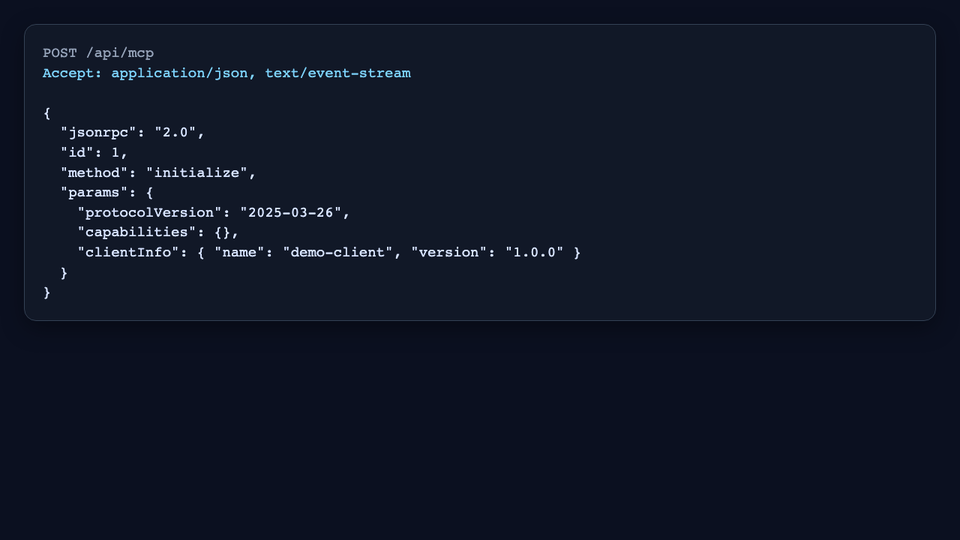
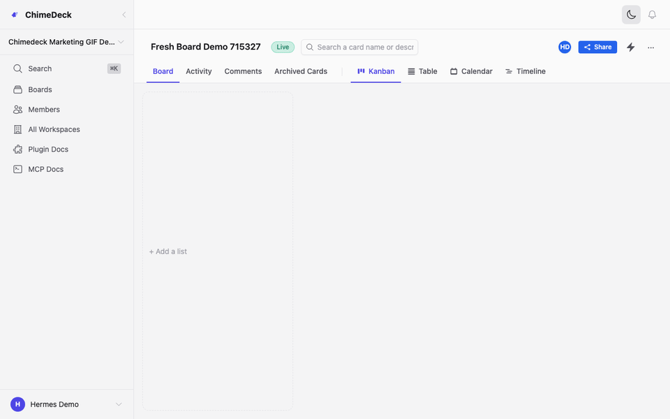
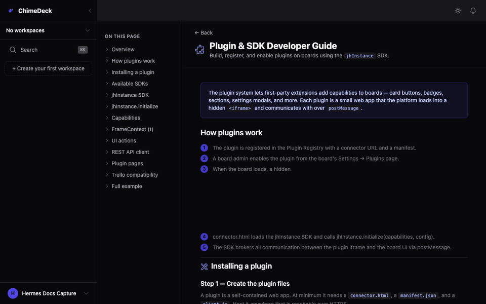
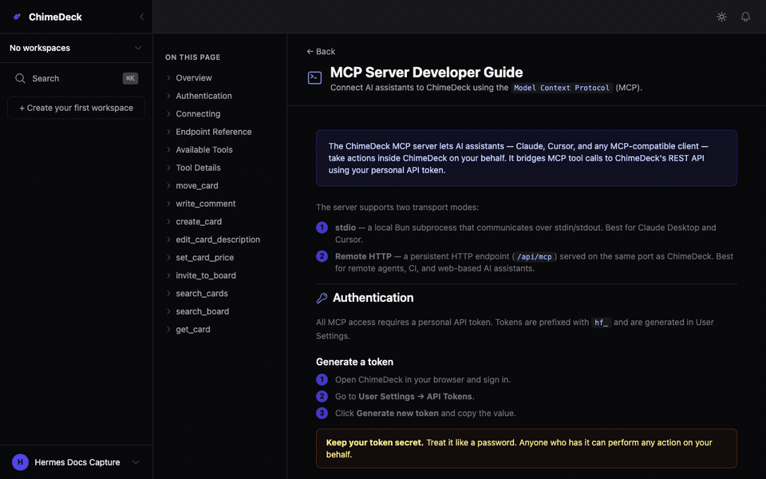
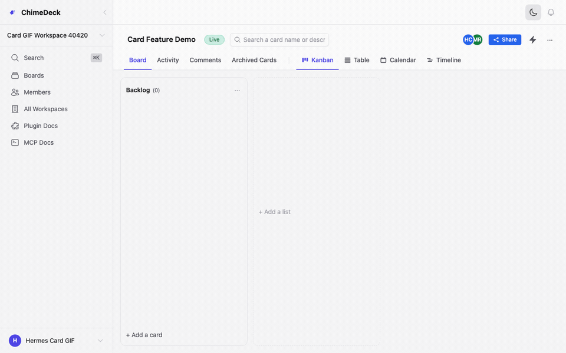

# Features

A visual walkthrough of key website functionality.

This page is designed for GitHub markdown rendering and can be linked from README to behave like a first-class documentation tab for contributors.

## Quick Navigation

- [Core Work Management](#core-work-management)
- [Collaboration Comments](#collaboration-comments)
- [Multiple Views](#multiple-views)
- [Search Findability](#search-findability)
- [Attachments Content](#attachments-content)
- [Automation Extensibility](#automation-extensibility)
- [First-Party CLI](#first-party-cli)
- [MCP Support](#mcp-support)
- [Fresh Board Light Mode](#fresh-board-light-mode)
- [Plugin Docs Light Mode](#plugin-docs-light-mode)
- [MCP Docs Light Mode](#mcp-docs-light-mode)
- [Card Creation Light Mode](#card-creation-light-mode)

---

## Core Work Management

Source: specs/gifs/01-core-work-management.gif

## Collaboration Comments

Source: specs/gifs/02-collaboration-comments.gif

## Multiple Views

Source: specs/gifs/03-multiple-views.gif

## Search Findability

Source: specs/gifs/04-search-findability.gif

## Attachments Content

Source: specs/gifs/05-attachments-content.gif

## Automation Extensibility

Source: specs/gifs/06-automation-extensibility.gif

## First-Party CLI

Source: specs/gifs/07-first-party-cli.gif

## MCP Support

Source: specs/gifs/08-mcp-support.gif

## Fresh Board Light Mode

Source: specs/gifs/09-fresh-board-light-mode.gif

## Plugin Docs Light Mode

Source: specs/gifs/10-plugin-docs-light-mode.gif

## MCP Docs Light Mode

Source: specs/gifs/11-mcp-docs-light-mode.gif

## Card Creation Light Mode

Source: specs/gifs/12-card-creation-light-mode.gif

---

## Notes

- GitHub does not support adding a custom top navigation tab directly from a markdown file in most repositories.
- The usual approach is to link this file prominently from README (for example near the top under Documentation).
- Keeping this file at repository root helps discoverability.
