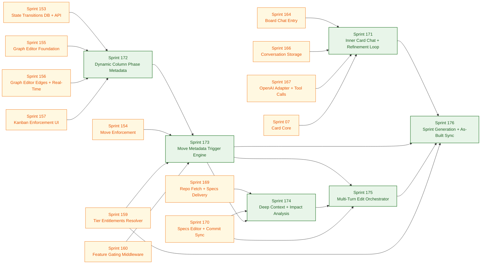

# Sprint Plan — Collaborative Kanban System

> **Source of truth:** [`specs/architecture/requirements.md`](../architecture/requirements.md)  
> **Architecture decisions:** [`specs/architecture/technical-decisions.md`](../architecture/technical-decisions.md)  
> **Event sourcing:** [`specs/architecture/event_sourcing.md`](../architecture/event_sourcing.md)  
> **Real-time protocol:** [`specs/architecture/real_time_sync_protocol.md`](../architecture/real_time_sync_protocol.md)

---

## Guiding Principles

- Each sprint delivers **1–2 tightly coupled features** that can be tested end-to-end
- No sprint begins without the previous sprint's acceptance criteria being met
- Architecture follows `copilot-instructions.md`: group by feature, Bun runtime, REST conventions
- Every sprint includes: server routes, client UI, Knex migration, unit + integration tests

---

## Sprint Overview

> **Status key:** 🟢 Ready to start — 🔵 Blocked on previous sprint — ⬜ Future

| Sprint | Feature(s) | Key Deliverables | Status |
|--------|-----------|-----------------|--------|
| [01](./sprint-01.md) | Project Setup | Docker (Redis optional), Knex baseline, **feature flags infra**, CI skeleton | 🟢 Ready |
| [02](./sprint-02.md) | Build Tooling & Docker | `package.json` scripts, multi-stage Dockerfile, docker-compose dev/prod | 🟢 Ready after 01 |
| [03](./sprint-03.md) | Authentication | Email/password login, JWT, refresh token, OAuth | 🔵 Needs 02 |
| [04](./sprint-04.md) | Workspace Lifecycle | Create workspace, invite, accept, RBAC | 🔵 Needs 03 |
| [05](./sprint-05.md) | Board Lifecycle | Create, archive, delete, duplicate board | 🔵 Needs 04 |
| [06](./sprint-06.md) | List Management | CRUD lists, fractional index reorder | 🔵 Needs 05 |
| [07](./sprint-07.md) | Card Core | CRUD cards, move between lists | 🔵 Needs 06 |
| [08](./sprint-08.md) | Card Extended Fields | Labels, assignees, due dates, checklists | 🔵 Needs 07 |
| [09](./sprint-09.md) | Real-Time Infrastructure | WebSocket, pub/sub abstraction (Redis or in-memory), event store | 🔵 Needs 08 |
| [10](./sprint-10.md) | Real-Time Collaboration | Sync protocol, optimistic UI, conflict resolution | 🔵 Needs 09 |
| [11](./sprint-11.md) | Comments & Activity Log | Comments CRUD, versioning, immutable activity | 🔵 Needs 10 |
| [12](./sprint-12.md) | Attachments | File upload (S3), external URL, virus scan | 🔵 Needs 11 |
| [13](./sprint-13.md) | Search & Presence | Full-text search, presence indicators | 🔵 Needs 12 |
| [14](./sprint-14.md) | Observability & Hardening | OTEL, rate limiting, security audit | ⬜ Future |
| **— UI Layer —** | | | |
| [15](./sprint-15.md) | UI Foundation | Vite + React + Tailwind, routing shell, Redux store, API client | 🔵 Needs 03 |
| [16](./sprint-16.md) | Authentication UI | Login/Signup pages, OAuth buttons, token refresh on boot | 🔵 Needs 15 |
| [17](./sprint-17.md) | Workspace Dashboard | App shell, sidebar, workspace switcher, boards grid | 🔵 Needs 16 |
| [18](./sprint-18.md) | Board View (Kanban) | DnD columns + cards, inline edit, optimistic mutations | 🔵 Needs 17 |
| [19](./sprint-19.md) | Card Detail Modal | Rich modal: Markdown, labels, members, due date, checklist | 🔵 Needs 18 |
| [20](./sprint-20.md) | Real-Time UI | WebSocket wiring, live updates, reconnection indicator, conflict toasts | 🔵 Needs 19 + 10 |
| [21](./sprint-21.md) | Comments, Activity & Attachments UI | Threaded comments, activity feed, file upload panel | 🔵 Needs 20 + 12 |
| [22](./sprint-22.md) | Search, Presence & Polish | ⌘K palette, presence avatars, theme toggle, skeletons, a11y | 🔵 Needs 21 + 13 |
| **— Extensions —** | | | |
| [23](./sprint-23.md) | Email Verification (SES) | `EMAIL_VERIFICATION_ENABLED` flag, AWS SES module, verify-email flow | 🔵 Needs 03 |
| [24](./sprint-24.md) | Profile Settings | Avatar upload (S3), nickname field, `/settings/profile` page | 🔵 Needs 12 + 17 |
| [25](./sprint-25.md) | @Mentions | Autocomplete dropdown, mention parsing, chips in card + comments | 🔵 Needs 11 + 19 + 24 |
| [26](./sprint-26.md) | Mention Notifications | In-app bell, notification panel, real-time WS delivery | 🔵 Needs 25 + 20 |
| [27](./sprint-27.md) | Collapsible Label Chips | Label pills on card tiles, collapsed/expanded toggle, localStorage persist | 🔵 Needs 18 + 06 |
| [28](./sprint-28.md) | Member Avatar Popover | Profile popover on card tile avatars, context-aware remove/edit actions | 🔵 Needs 07 + 15 |
| **— Monetization & Events —** | | | |
| [29](./sprint-29.md) | Configurable Events in Activity Feed | System events (member, due date, move) shown inline with comments; configurable filter file | 🔵 Needs 11 + 21 |
| [30](./sprint-30.md) | Card Money & Currency (DB + API) | `amount` + `currency` columns on cards, PATCH validation, activity event | 🔵 Needs 07 |
| [31](./sprint-31.md) | Card Money Badge UI | `CardMoneyBadge` on tile, editable Value section in card modal, Heroicons for calendar | 🔵 Needs 30 + 18 + 19 |
| [32](./sprint-32.md) | Board Monetization Type | `monetization_type` DB column, board settings radio UI, `payToPaidConfig` predicate | 🔵 Needs 30 |
| [33](./sprint-33.md) | Stripe Embedded Payments | `stripePaymentButtonsConfig`, Stripe PaymentIntent endpoint, embedded checkout modal | 🔵 Needs 32 |
| **— Plugin System —** | | | |
| [34](./sprint-34.md) | Plugin System: Server, SDK & DB | DB migrations (plugins, board_plugins, plugin_data), board-plugin API, plugin registry API, `jhInstance` SDK bundle served at `/sdk/jh-instance.js` | � Done |
| [35](./sprint-35.md) | Plugin Dashboard UI & Board Integration | Plugin admin dashboard, hidden iframe injection, postMessage bridge, card-badges/card-buttons/section UI injections, plugin popups & modals | 🟢 Done |
| [36](./sprint-36.md) | Plugin Registry: Registration UI & Search | `POST/PATCH/DELETE /api/v1/plugins` (platform admin), search + category filter on `GET /api/v1/plugins`, Register Plugin modal, one-time api_key reveal, `PluginSearchBar` | 🟢 Done |
| [37](./sprint-37.md) | Plugin SDK: Context Queries, Data Fix & Button Callbacks | Fix `CTX_CARD/LIST/BOARD/MEMBER` handlers in bridge, fix `t.get()`/`t.set()` `resourceId`, button callback registry in SDK so `card-badges`/`card-buttons` actually work | 🟢 Ready after 36 |
| [38](./sprint-38.md) | Plugin Data: Board Isolation & Cross-Board Validation | Add `board_id` to `plugin_data`, use it in GET/SET queries, validate card/list resource belongs to board, isolate member-scoped data per board | 🔵 Needs 37 |
| [39](./sprint-39.md) | Plugin Domain Whitelisting & Edit Plugin UI | `whitelisted_domains` on plugins table, board-level `allowedDomains` subset in `board_plugins.config`, bridge origin enforcement, Edit Plugin modal (platform admin), Board Domain Allowlist panel | 🔵 Needs 36 + 38 |
| [113](./sprint-113.md) | Plugin Registration Global Panel | Platform-admin `/plugins` page in sidebar; registry table with edit/deactivate; `Register Plugin` two-step modal (form → one-time API key reveal); search + category + status filters; `GET /api/v1/plugins/:pluginId` | 🔵 Needs 36 + 17 |
| [114](./sprint-114.md) | Board Plugin Discovery & Enable Flow | `GET /api/v1/boards/:boardId/plugins/available`; Board Plugins panel split into Enabled + Discover sections; one-click Enable/Disable; real-time row transitions; replaces board-by-board creation | 🔵 Needs 113 + 35 |
| **— Account Management —** | | | |
| [40](./sprint-40.md) | Change Email | Authenticated email-change request, confirmation link to new address, token invalidation on commit | 🔵 Needs 23 + 24 |
| [41](./sprint-41.md) | Forgot Password / Password Reset | `POST /auth/forgot-password`, reset email via SES, `/reset-password?token=` page, session invalidation | 🔵 Needs 23 + 16 |
| [42](./sprint-42.md) | Split AWS Credentials (LocalStack vs SES) | `S3_AWS_ACCESS_KEY_ID`/`S3_AWS_SECRET_ACCESS_KEY` for S3/LocalStack; global `AWS_*` for SES; fallback chain | 🔵 Needs 12 + 23 |
| **— Admin & Access Control —** | | | |
| [43](./sprint-43.md) | Email Domain Restriction | Configurable `ALLOWED_EMAIL_DOMAINS` list; guard registration + change-email; `EMAIL_DOMAIN_RESTRICTION_ENABLED` flag | 🔵 Needs 03 + 40 |
| [44](./sprint-44.md) | Admin: Create External User API | `POST /api/v1/admin/users`; `ADMIN_EMAIL_DOMAINS` (separate from `ALLOWED_EMAIL_DOMAINS`); auto/manual password; invitation email via SES; `ADMIN_INVITE_EMAIL_ENABLED` flag; `credentials` in response | 🔵 Needs 23 + 43 |
| [45](./sprint-45.md) | Admin: Invite External Users UI | Sidebar entry (admin-domain only); invite modal with password-mode radio + send-email toggle; copyable credential sheet | 🔵 Needs 17 + 44 |
| **— Requirements Gap Fixes —** | | | |
| [46](./sprint-46.md) | DB Schema: Board & Card Extensions | `boards`: `visibility`, `description`, `background` columns; `cards`: `start_date` column; expose in API | ⬜ Future |
| [47](./sprint-47.md) | UUID v7 Migration | Replace `uuidv4()` with `uuidv7()` across all entity primary keys; centralise in `server/common/uuid.ts` | ⬜ Future |
| [48](./sprint-48.md) | Board Stars, Followers & Board-Level Views | `board_stars` + `board_followers` tables; star/favourite API + UI; board activity log, comments, archived cards panels | ⬜ Future |
| [49](./sprint-49.md) | Guest Role + Board Visibility Access Control | `GUEST` membership role; `board_guest_access` table; Private/Workspace/Public visibility enforcement middleware | ⬜ Needs 46 |
| [50](./sprint-50.md) | API & Event Envelope Fixes | Standardise error envelope to `{ error: { code, message } }`; emit `member_joined` event; add `version` field to all real-time events | ⬜ Future |
| [51](./sprint-51.md) | Auth Hardening & WS Polling Fallback | Access token TTL → 24h; WS close on token revocation; client-side forced logout on 401; HTTP polling fallback | ⬜ Future |
| [52](./sprint-52.md) | View Persistence + Table View | `user_board_view_prefs` table; GET/PUT view-preference API; Board view switcher UI; Table view component | ⬜ Future |
| [53](./sprint-53.md) | Calendar View | Monthly + weekly calendar grid; cards by due date; drag-to-reschedule (U-CAL-01/02/03) | ⬜ Needs 52 |
| [54](./sprint-54.md) | Timeline / Gantt View | Swimlanes by list; bars from `start_date` to `due_date`; zoom levels; drag to resize/move (U-GNT-01/02/03) | ⬜ Needs 46 + 52 |
| [55](./sprint-55.md) | Custom Fields | `custom_fields` + `card_custom_field_values` tables; field definition API; card value API; card modal + tile badge UI | ⬜ Future |
| [56](./sprint-56.md) | Business Logic Invariants | Archived board read-only guard; workspace ≥1 Owner invariant; delete-with-nested-content confirmation flag | ⬜ Future |
| [57](./sprint-57.md) | Security Hardening | CSRF `Origin` header guard on all mutations; server-side input sanitization (`sanitize-html`) on all text fields | ⬜ Future |
| [58](./sprint-58.md) | Observability & Reliability | Install `@opentelemetry/*` packages; IndexedDB offline mutation queue; conflict counter + propagation delay histogram | ⬜ Future |
| **— Attachments & Automation —** | | | |
| [59](./sprint-59.md) | Card Attachment Upload (Enhanced Backend) | Multipart S3 upload for large files, MIME-type allowlist, image thumbnail generation (sharp), orphan-cleanup worker | ⬜ Needs 12 |
| [60](./sprint-60.md) | Card Attachment Upload UI | Drag-and-drop drop zone, clipboard paste (Cmd+V), multi-file progress bars, thumbnail previews, Heroicons for file types | ⬜ Needs 59 + 21 |
| [61](./sprint-61.md) | Automation: DB Schema & Core Engine | `automations`, `automation_triggers`, `automation_actions`, `automation_run_log` tables; rule evaluator + executor; `AUTOMATION_ENABLED` flag | ⬜ Needs 07 + 09 |
| [62](./sprint-62.md) | Automation: Triggers | 15 trigger types (card moved, label added, member assigned, checklist completed, …); trigger registry; `GET /automation/trigger-types` | ⬜ Needs 61 |
| [63](./sprint-63.md) | Automation: Actions | 18 action types (move card, add label, assign member, post comment, archive, sort list, …); variable substitution; `GET /automation/action-types` | ⬜ Needs 62 |
| [64](./sprint-64.md) | Automation: Scheduled & Due Date Commands | `pg_cron` + `pg_notify`/`LISTEN` scheduler (no `setInterval`); `automation_scheduler_tick()` stored proc; Bun Worker fallback for local dev (`AUTOMATION_USE_PGCRON=false`); **pre-deploy ops task required on self-hosted prod**: install `postgresql-16-cron` package, add to `shared_preload_libraries`, restart PostgreSQL, then `CREATE EXTENSION pg_cron` + `cron.schedule(...)` as superuser | ⬜ Needs 63 |
| [65](./sprint-65.md) | Automation: Rules Builder UI | Board header **BoltIcon button** (left of `...`); slide-in Automation panel; guided trigger + action builder; Heroicons throughout | ⬜ Needs 64 + 18 |
| [66](./sprint-66.md) | Automation: Card & Board Buttons UI | Card back "Automation" section with custom Heroicon buttons; board header action buttons; icon picker (24 Heroicons); Buttons tab live | ⬜ Needs 65 + 19 |
| [67](./sprint-67.md) | Automation: Scheduled Commands UI | Schedule tab live: calendar-command builder, due-date-command builder, schedule summary formatter, 3 quick-start templates | ⬜ Needs 66 + 64 |
| [68](./sprint-68.md) | Automation: Run History, Logs & Quota | Log tab: paginated run log, expandable rows, real-time WS updates; quota bar (`ChartBarIcon`); monthly quota via env var | ⬜ Needs 67 |
| [69](./sprint-future-1.md) | In-House Virus Scanning (ClamAV) | ClamAV sidecar, INSTREAM TCP protocol, EICAR integration test, `REJECTED` UI state with tooltip | ⬜ Needs 59 |
| **— Notifications —** | | | |
| [70](./sprint-70.md) | Notification Preferences: DB + API | `notification_preferences` table; GET/PATCH preference API; `preferenceGuard` helper; gate in-app + email dispatch; `NOTIFICATION_PREFERENCES_ENABLED` flag | ⬜ Needs 26 + 23 |
| [71](./sprint-71.md) | Notification Preferences UI | Toggle matrix in Profile Settings (4 types × 2 channels); optimistic PATCH; email column disabled when SES off | ⬜ Needs 70 + 24 |
| [72](./sprint-72.md) | Email Notifications (Mentions + Board Activity) | SES email templates for mention/card_created/card_moved/card_commented; `boardActivityDispatch`; `EMAIL_NOTIFICATIONS_ENABLED` flag; fire-and-forget | ⬜ Needs 70 + 23 + 26 |
| [73](./sprint-73.md) | In-App Notifications for Board Activity | Extend in-app notifications to card_created/card_moved/card_commented; WS push to board members; new icons + copy in notification panel; `type` filter on list API | ⬜ Needs 70 + 26 + 72 |
| [95](./sprint-95.md) | Board-scoped Notification Preferences (Global) | `board_notification_preferences` table; per-board global on/off toggle in board settings "User settings"; `user_notification_settings` master toggle; guard in `boardActivityDispatch` | ⬜ Needs 70 + 73 |
| [96](./sprint-96.md) | Profile Settings: Notifications Tab | Refactor `EditProfilePage` into tab layout (Profile / Notifications); URL-driven tab state (`?tab=notifications`); master toggle + preference matrix on Notifications tab | ⬜ Needs 71 + 95 |
| [97](./sprint-97.md) | New Notification Types: card_updated, card_deleted, card_archived | DB constraint extended; server dispatch wired on card PATCH/DELETE/archive; client types + labels + icons for 3 new types; preference panel shows all 9 types | ⬜ Needs 73 + 88 + 96 |
| [98](./sprint-98.md) | card_commented Notification Dispatch | Wire comment creation to `boardActivityDispatch`; in-app + WS push; email via SES for `card_commented`; self-exclusion guard | ⬜ Needs 72 + 73 |
| [99](./sprint-99.md) | Email Templates for New Notification Types | SES templates for card_updated / card_deleted / card_archived; fix `shared.ts` deep-link to `?tab=notifications`; verify card_commented end-to-end | ⬜ Needs 72 + 97 + 98 |
| [100](./sprint-100.md) | Board-Level Per-Type Notification Preferences | `board_notification_type_preferences` table; GET/PATCH/DELETE API; override cascade (board-type → user-type → default); `BoardNotificationTypePreferences` toggle matrix in board settings | ⬜ Needs 95 + 96 + 97 |
| **— External API, MCP & CLI —** | | | |
| [101](./sprint-101.md) | API Token Infrastructure | `api_tokens` DB table; `POST/GET/DELETE /api/v1/tokens`; SHA-256 hashed storage; token prefix for display; extend `authenticate` middleware to accept `hf_...` tokens alongside JWT | ⬜ Needs 03 + 15 |
| [102](./sprint-102.md) | API Token UI (User Settings) | "API Tokens" settings page; generate modal (name + expiry); one-time copy modal; token list with revoke; RTK Query slice | ⬜ Needs 101 + 96 |
| [103](./sprint-103.md) | External API Surface Audit & Card Money Endpoint | Audit all 6 external operations; add `PATCH /api/v1/cards/:id/money`; add `POST /api/v1/cards/:id/comments` if missing; verify permission guard on board invite; `docs/api-reference.md` | ⬜ Needs 101 |
| [104](./sprint-104.md) | MCP Server | `server/extensions/mcp/` — MCP stdio server with 6 tools (move_card, write_comment, create_card, edit_card_description, set_card_price, invite_to_board); token auth; Claude Desktop + Cursor setup README | ⬜ Needs 101 + 103 |
| [105](./sprint-105.md) | CLI | `cli/` — `chimedeck` Bun CLI with 6 sub-commands; `--token` flag + `CHIMEDECK_TOKEN` env; `--json` mode; `cli/README.md` | ⬜ Needs 101 + 103 |
| **— Admin Enhancements —** | | | |
| [74](./sprint-74.md) | Admin: Auto-Verify External User Email | `autoVerifyEmail` param on `POST /api/v1/admin/users`; sets `email_verified_at` at creation; checkbox in invite modal (default: checked); verification status in credential sheet | ⬜ Needs 44 + 45 |
| **— UI / UX Polish —** | | | |
| [75](./sprint-75.md) | Light / Dark Theme (Full Implementation) | Audit all components for hardcoded dark classes; dual-mode Tailwind `dark:` variants throughout; theme persisted in `localStorage`; no flash on load; `ThemeToggle` Sun/Moon icons | ⬜ Needs 22 |
| [76](./sprint-76.md) | Board Background Image Upload | S3 upload for board backgrounds (`board-backgrounds/{boardId}/`); `POST/DELETE /api/v1/boards/:id/background`; background renders behind columns only — columns stay opaque; thumbnail in workspace grid + search results; real-time WS sync | ⬜ Needs 46 + 12 + 75 |
| [77](./sprint-77.md) | Granular Search (Scoped by Type) | Scope tabs (`All` / `Boards` / `Cards`) in command palette; passes `type=board|card` to search API; scoped empty states; placeholder text matches scope; `sessionStorage` persistence | ⬜ Needs 22 + 13 + 76 |
| **— Board Access Control —** | | | |
| [78](./sprint-78.md) | Board Members Table + Visibility Enforcement (Server) | `board_members` table + migration; auto-insert creator as board ADMIN; visibility middleware; PRIVATE/WORKSPACE/PUBLIC access matrix; board member CRUD API; guest/PRIVATE board filtering on workspace boards list | ⬜ Needs 46 + 49 |
| [79](./sprint-79.md) | Board Member Management UI | Visibility selector in board settings; Board Members Panel (add/change role/remove); workspace boards grid visibility badge; board header avatar stack | ⬜ Needs 78 + 17 + 18 |
| [80](./sprint-80.md) | Guest Experience UI | Guest invite flow (by email, stub account creation); scoped workspace view for GUEST role (granted boards only, member list hidden); client-side permission guards; guest sidebar labels | ⬜ Needs 79 + 49 + 44 |
| **— Offline Experience —** | | | |
| [82](./sprint-82.md) | Rich Text Toolbar One-Line Overflow + Inline Attachments | Keep description/comment rich toolbar to one line, move secondary commands into searchable `+` menu, and show inline upload previews (image thumbnail or file name) while uploading attachments from editor | ⬜ Needs 11 + 21 + 81 |
| [83](./sprint-83.md) | Offline Drafts for Card Description + Comments | User-private draft store (description/comment), local IndexedDB draft persistence, cross-device draft sync for same user, offline Save/Comment replay with idempotency and retry states | ⬜ Needs 11 + 20 + 58 + 81 |
| **— Board UX & Access Improvements —** | | | |
| [84](./sprint-84.md) | Board-Scoped Search Bar | Board-header search bar scoped to active board only; board-local cards/lists results; board route integration for card open | ⬜ Needs 13 + 18 + 77 |
| [85](./sprint-85.md) | Collapsible Sidebar Drawer (Tailwind) | Desktop collapse rail + mobile drawer behavior; persisted sidebar state; keyboard and accessibility support | ⬜ Needs 15 + 17 + 18 |
| [86](./sprint-86.md) | Access-Aware Board Search Results | Hide inaccessible boards from search results; server-side permission filtering; stale-result click guard in client | ⬜ Needs 13 + 77 + 78 |
| [87](./sprint-87.md) | Board Deletion Auto-Refresh | Remove deleted boards from UI without reload; redirect when current board deleted; workspace-wide real-time deletion sync | ⬜ Needs 05 + 17 + 20 |
| [88](./sprint-88.md) | Expanded Card Activity Tracking | Track `card_created`, `card_moved`, `card_member_assigned` and unassign events in activity feed with real-time updates | ⬜ Needs 07 + 11 + 29 + 73 |
| [89](./sprint-89.md) | Guest Role Split: VIEWER vs MEMBER | Split board GUEST into read-only VIEWER and write-capable MEMBER (board-scoped only); `guest_type` column on `board_guest_access`; API + UI updates | ⬜ Needs 49 + 80 |
| **— Internationalisation (i18n) —** | | | |
| [90](./sprint-90.md) | i18n Phase 1: Comment, Activity & Attachment | Extract all hardcoded strings in Comment, Activity, Attachment/Attachments extensions into `translations/en.json`; bracket-notation access; no library | ⬜ Needs 11 + 21 |
| [91](./sprint-91.md) | i18n Phase 2: Automation | Extract ~20-component Automation extension (rules, buttons, schedules, run log) into `Automation/translations/en.json` | ⬜ Needs 90 + 61–68 |
| [92](./sprint-92.md) | i18n Phase 3: Plugins | Extract ~15-component Plugins extension (search bar, register/edit modals, board panel, domain allowlist) into `Plugins/translations/en.json` | ⬜ Needs 90 + 34–39 |
| [93](./sprint-93.md) | i18n Phase 4: CustomFields, CalendarView, TimelineView & TableView | Create `translations/en.json` for four view/data extensions; extract all labels, aria-labels, and empty-state strings | ⬜ Needs 90 + 52–55 |
| [94](./sprint-94.md) | i18n Phase 5: Remaining Extensions & Common/Layout | Finish i18n coverage: Mention, Notifications, UserProfile, AdminInvite, Realtime, OfflineDrafts, BoardViews, `src/common/`, `src/layout/`; zero hardcoded strings across all of `src/` | ⬜ Needs 91–93 |
| **— Health Check —** | | | |
| [115](./sprint-115.md) | Health Check Tab: Backend & Config | `board_health_checks` + `board_health_check_results` tables; `server/config/health-check-services.json` presets; `GET /health-check/presets`; board CRUD endpoints (`GET/POST/DELETE`); on-demand `probe` + `probe-all`; probe engine with green/amber/red classification; SSRF prevention; `HEALTH_CHECK_ENABLED` flag | ⬜ Needs 05 + 03 |
| [116](./sprint-116.md) | Health Check Tab UI | 5th board tab "Health Check"; traffic-light status dots (green/amber/red/gray); one row per endpoint with name, URL, response time; Add Service modal (preset picker + custom URL); manual ↻ Refresh + 60-second auto-refresh with Page Visibility pause; empty state | ⬜ Needs 115 + 18 |
| [117](./sprint-117.md) | Secure Attachment Proxy + Alias & Comment/Edit Actions | Authenticated proxy endpoints replace raw S3 presigned URLs; `alias` DB column + `PATCH` endpoint for rename; Edit (inline rename) and Comment (insert markdown link) action buttons on attachment rows | ⬜ Needs 12 + 59 + 60 |
| [121](./sprint-121.md) | Email Template Centralisation & Handlebars Migration | Extract all email HTML into `templates/html/*.html` files; `renderTemplate` Handlebars helper with `Bun.file` + compile cache; replace `${var}` interpolation with `{{var}}`; update call sites to `await` async builders | ⬜ Needs 23 |
| [123](./sprint-123.md) | Sentry Monitoring: Client + Server | Add Sentry SDK wiring for React client and Bun server, unified release/environment tagging, source map upload, and error-boundary capture with trace propagation | ⬜ Needs 15 + 03 + 58 |
| **— Comments Enhancements —** | | | |
| [129](./sprint-129.md) | Comment Emoji Reactions: DB + API | `comment_reactions` table; `POST/DELETE /api/v1/comments/:id/reactions`; reactions joined onto comment list response; WS events | ⬜ Needs 11 |
| [130](./sprint-130.md) | Comment Emoji Reactions: UI | `CommentReactions` pill row; `EmojiPickerPopover` (`@emoji-mart/react`); optimistic toggle; real-time WS sync | ⬜ Needs 129 + 21 |
| [131](./sprint-131.md) | Comment Threaded Replies: DB + API | `parent_id` on `comments`; one-level-deep guard; `GET /api/v1/comments/:id/replies`; `reply_count` in list; WS event | ⬜ Needs 11 |
| [132](./sprint-132.md) | Comment Threaded Replies: UI | Reply button on top-level comments; inline `CommentEditor` composer; load-on-demand `CommentReplyThread`; real-time sync | ⬜ Needs 131 + 130 |
| **— Design System —** | | | |
| [133](./sprint-133.md) | Design System: Replace Raw Buttons | `link` variant + `IconButton` component; audit + replace all ad-hoc `<button>` elements across Attachment, Workspace, List, Sidebar, Timeline, Table, Auth, Plugins, Comment, Card | ⬜ Needs 15 |
| [134](./sprint-134.md) | Design Stylesheet Page | `/design-system` route (dev-only, `DESIGN_SYSTEM_ENABLED` flag); colour tokens, typography, all Button variants, comments demo, reactions demo, stubbed components — no API calls | ⬜ Needs 133 |
| **— Webhooks —** | | | |
| [135](./sprint-135.md) | Webhooks: DB + API Infrastructure | `webhooks` + `webhook_deliveries` tables; `POST/GET/PATCH/DELETE /api/v1/webhooks`; HMAC-SHA256 `v0` signing; fire-and-forget dispatch; SSRF guard; `WEBHOOKS_ENABLED` flag | ⬜ Needs 101 |
| [136](./sprint-136.md) | Webhooks: Register UI (`WebhooksRegisterPage`) | `/settings/webhooks` page (mirrors `ApiTokenPage`); register-endpoint modal with event-type checklist; one-time signing-secret reveal modal; edit + delete dialogs; `SignatureVerificationSnippet` JS code guide | ⬜ Needs 135 + 102 |
| **— Card Cover —** | | | |
| [137](./sprint-137.md) | Card Cover: Aspect Ratio & GIF Support | Auto 16:9 / 1:1 aspect ratio from image dimensions; `object-contain` rendering; GIF covers skip WebP thumbnail and loop natively; `width`/`height` stored on attachments | ⬜ Needs 90 |
| **— Trello API Wrapper —** | | | |
| [142](./sprint-142.md) | Trello Compat: Foundation | `/trello/1/*` compatibility layer backed by ChimeDeck data; `trelloAuth` middleware (accepts `?token=hf_xxx` OR Bearer); Trello response type definitions; entity serializers (member, label, position); `errors.ts` helper; `TRELLO_COMPAT_ENABLED` flag; `GET /trello/1/members/me` | ⬜ Needs 101 |
| [143](./sprint-143.md) | Trello Compat: Boards | Full `/trello/1/boards/*` surface — CRUD, lists, cards, members, labels, memberships, actions; board serializer; `defaultLists` creation; permission guard | ⬜ Needs 142 |
| [144](./sprint-144.md) | Trello Compat: Cards | Full `/trello/1/cards/*` surface — CRUD, comments, checklists, checkItems, members, labels, attachments, customFieldItems, board/list sub-resources; card serializer | ⬜ Needs 143 |
| [145](./sprint-145.md) | Trello Compat: Lists | Full `/trello/1/lists/*` surface — CRUD, archiveAllCards, moveAllCards, board + cards sub-resources; `pos` top/bottom/numeric conversion; list serializer | ⬜ Needs 143 |
| [146](./sprint-146.md) | Trello Compat: Checklists & Labels | Full `/trello/1/checklists/*` and `/trello/1/labels/*` surfaces — checklist/checkItem CRUD with `idChecklistSource` copy; label CRUD; serializers | ⬜ Needs 144 |
| [147](./sprint-147.md) | Trello Compat: Members & Organizations | Full `/trello/1/members/*` and `/trello/1/organizations/*` surfaces — member profile + boards/cards/orgs; workspace CRUD + invite by email; org serializer | ⬜ Needs 143 |
| [148](./sprint-148.md) | Trello Compat: Actions, Search & CustomFields | `/trello/1/actions/*` (comments + activity → Trello action types); `/trello/1/search` + `/trello/1/search/members/`; `/trello/1/customFields/*` with card value upsert — completes full compatibility surface | ⬜ Needs 142 |
| [149](./sprint-149.md) | Trello Compat: Response Normalization Baseline & Contract Matrix | Adapter-only parity matrix for all implemented `/trello/1/*` endpoints (sprints 142–148); canonical serialization rules; contract-test scaffolding; no Native API changes | ⬜ Needs 148 |
| [150](./sprint-150.md) | Trello Compat: Actions Response Normalization | Trello Actions parity against Atlassian docs: normalize action payloads, field projection, member/memberCreator/display semantics, reactions list/get/create/delete/summary, action organization/field routes | ⬜ Needs 149 |
| [151](./sprint-151.md) | Trello Compat: Core Entity Response Normalization | Normalize boards/cards/lists/checklists/labels response shapes and cross-endpoint serializer consistency; apply Trello-style field projection where supported | ⬜ Needs 149 |
| [152](./sprint-152.md) | Trello Compat: Metadata & Search Response Normalization | Normalize members/organizations/search/customFields responses, envelopes, and Trello-style error semantics for adapter-only routes | ⬜ Needs 149 + 150 + 151 |
| **— Enforceable State Transitions —** | | | |
| [153](./sprint-153.md) | State Transitions: DB + Core API | `board_state_transitions` table, graph JSONB schema, GET/PUT graph API, `/rules` endpoint for agents/MCP, `POST /copy` to clone to another board, `STATE_TRANSITIONS_ENABLED` flag, WS broadcast on save | ⬜ Needs 05 + 06 + 07 |
| [154](./sprint-154.md) | State Transitions: Card Move Enforcement | `validateCardMove` guard wired into card move handler, `422 state-transition-forbidden` response with allowed states payload, in-memory rules cache, activity log on blocked move, Trello-compat error mapping | ⬜ Needs 153 |
| [155](./sprint-155.md) | State Transitions: Graph Editor Foundation | `bun add @xyflow/react`; Board Settings entry (`ArrowsRightLeftIcon`); full-screen overlay graph editor; column nodes with handles; draggable positions persisted; enable/disable toggle saved server-side | ⬜ Needs 153 + 18 + 19 |
| [156](./sprint-156.md) | State Transitions: Edges, Toolbar & Real-Time Sync | Drag-to-create edges, `TransitionEdge` component (straight/curved, one/two-way), edge inspector, toolbar (Add Column, Arrow type, Add Note), `StickyNoteNode`, real-time WS collaborative editing, undo stack, `config/actionTypes.ts` extensibility stub | ⬜ Needs 155 + 09 + 10 |
| [157](./sprint-157.md) | State Transitions: Kanban Enforcement UI + Copy to Board | `useStateTransitionGuard` DnD pre-check, `StateTransitionErrorPopup`, forbidden-column drag-over highlight, locked-column icon, Copy to Board modal (cross-workspace), "Transitions Active" banner | ⬜ Needs 154 + 156 |
| **— Subscriptions & Tier Gating —** | | | |
| [158](./sprint-158.md) | Subscriptions: Workspace Billing + Stripe Subscriptions | `workspace_subscriptions` + `stripe_webhook_events` tables; Stripe Checkout (subscription mode), Billing Portal, idempotent webhook; `getCurrentTier(workspaceId)` resolver; platform-admin override; `SUBSCRIPTIONS_ENABLED` flag | ⬜ Needs 03 + 04 + 33 |
| [159](./sprint-159.md) | Subscriptions: Tier Entitlements Config + Resolver | `server/config/subscription-tiers.ts` map (tier→limits + tier→features, `'unlimited'` sentinel); `limits.ts` helpers; `resolveEntitlements(workspaceId)`; workspace-scoped/owner-scoped `usage` counters; `GET /workspaces/:workspaceId/entitlements` | ⬜ Needs 158 |
| [160](./sprint-160.md) | Subscriptions: Conditional Feature-Gating Middleware | `feature-gates.ts` endpoint→feature map; `featureGate` middleware; `402 feature-not-in-plan`; `resolveWorkspaceContext` + resource-workspace tier resolution; `minimumTierFor` | ⬜ Needs 159 |
| [161](./sprint-161.md) | Subscriptions: Resource Limit Enforcement | `limitGuard.assertWithinLimit`; pre-create guards for workspace/board (dual cap)/column/member/guest/storage; `402 limit-reached`; read-only-over-limit downgrade behaviour | ⬜ Needs 159 + 04 + 05 + 06 + 12 + 78 + 89 |
| [162](./sprint-162.md) | Subscriptions: Tier-Aware Workspace-Wide Rate Limiting | Extend `rateLimiter.ts` to workspace-scoped shared READ/WRITE buckets from tier limits; `rl:ws:<id>:<class>` keys; `'unlimited'` bypass; `429` envelope with tier; fallback to Sprint 14 when disabled | ⬜ Needs 14 + 158 + 159 |
| [163](./sprint-163.md) | Subscriptions: Billing & Plan Management UI | `/workspaces/:workspaceId/settings/billing` page; CurrentPlanCard, UsageMeters, PlanComparisonGrid; Stripe Checkout/Portal redirects; shared `UpgradeModal` + `usePlanGate` 402 interceptor; inline lock/headroom affordances | ⬜ Needs 158 + 159 + 160 + 161 + 17 + 96 |
| [164](./sprint-164.md) | Board Chat UI Entry + Sidebar History | Board header chat icon beside plugin/settings; right-side chat drawer with conversation history list; org-member-only visibility baseline | ⬜ Needs 18 + 79 + 80 |
| [165](./sprint-165.md) | Board Chat Access Control + Guest Overrides | Board chat ACL policy (`org members only` by default), guest visibility/use toggles in chat sidebar, board-level settings + enforcement middleware | ⬜ Needs 164 |
| [166](./sprint-166.md) | Conversation Storage: Raw + Vector | Persist chat messages as raw text and vector embeddings; board-scoped retrieval/search API; migration and indexing strategy | ⬜ Needs 165 |
| [167](./sprint-167.md) | OpenAI-Compatible Adapter + Card Function Calling | Provider adapter with configurable API key/base URL/model; function-call orchestration for `create-card-from-chat` from conversation context | ⬜ Needs 166 + 07 |
| [168](./sprint-168.md) | Board Setting: GitHub Project URL | Board settings field `github_project_url`; only workspace members on board can set/update; audit event + validation | ⬜ Needs 79 + 114 |
| [169](./sprint-169.md) | Backend Repo Fetch + Specs Markdown Delivery | Backend function accepts GitHub project URL and returns downloaded repo path using GitHub App installation-token fetch; manifest-first + lazy `specs/**/*.md` loading for client view/edit | ⬜ Needs 168 |
| [170](./sprint-170.md) | Specs Markdown Editor + Commit Sync | Board `Documentation` tab next to `Health Check` opens TipTap markdown-mode editor; delta-save API for edits/new files; backend git service commit-and-push with app bot alias identity | ⬜ Needs 169 |
| [171](./sprint-171.md) | Inner Card Chat + AI Assist Refinement Loop | Card-level `AI Assist` entry, BA persona `/goal` questioning loop, quality score meter, pause/resume on card close, `READY_FOR_REVIEW` transition at score `>= 90` | ⬜ Needs 164 + 166 + 167 + 07 |
| [172](./sprint-172.md) | Dynamic Workflow Phase Metadata on Columns | Column rectangle metadata in state-transition graph (`workflowPhases`, phase config), editor controls, resolver API for move-time phase lookup | ⬜ Needs 153 + 155 + 156 + 157 |
| [173](./sprint-173.md) | Metadata Trigger Engine for Card Move Lifecycle | Move-time destination-column phase evaluation, async trigger jobs, idempotent run records, tier-aware phase gating for `SYNC_DOCUMENT`/`READY_FOR_DEV`/`GENERATE_SPRINT`/`UPDATE_AS_BUILT` | ⬜ Needs 172 + 154 + 159 + 160 |
| [174](./sprint-174.md) | Deep Context Gathering and Impact Analysis Service | Unified search across specs/code/cards/commit history, duplicate-effort detection, impact map, deterministic file-scope planner, context snapshot persistence | ⬜ Needs 169 + 170 + 173 |
| [175](./sprint-175.md) | Multi-Turn AI Editing Orchestrator for Specs Repo | Ordered run-state pipeline: `POST /ai/edit` -> context gather -> file scope -> create files -> edit files -> commit; resumable, auditable, path-guarded | ⬜ Needs 173 + 174 + 170 |
| [176](./sprint-176.md) | Requirement-to-Sprint Generation and As-Built Sync | On `GENERATE_SPRINT`, create sprint docs + child sprint cards; on `UPDATE_AS_BUILT`, sync architecture/security/changelog docs with traceable commits and tier-aware depth | ⬜ Needs 171 + 173 + 175 + 159 |


---

## Feature Flag Coverage

Feature flags infrastructure (`server/mods/flags/`) is delivered in **sprint 01** and is available to every subsequent sprint. Key flags unlocking sprint behaviour:

| Flag | First used | Effect when `false` |
|------|-----------|--------------------|
| `USE_REDIS` | Sprint 09 | In-memory pub/sub + node-cache (local dev) |
| `VIRUS_SCAN_ENABLED` | Sprint 12 | Attachments skip scan, go directly to `READY` |
| `OAUTH_GOOGLE_ENABLED` / `OAUTH_GITHUB_ENABLED` | Sprint 03 | Disable respective OAuth buttons |
| `RATE_LIMIT_ENABLED` | Sprint 14 | Bypass rate limiting (dev only) |
| `OTEL_ENABLED` | Sprint 14 | Skip telemetry initialisation |
| `SEARCH_ENABLED` | Sprint 13 | Return 501 on search endpoint |
| `EMAIL_VERIFICATION_ENABLED` | Sprint 23 | Skip email verification on register/login |
| `SES_ENABLED` | Sprint 23 | Log emails to console instead of sending via AWS SES |
| `PLUGINS_ENABLED` | Sprint 34 | Disable plugin routes and SDK endpoint entirely (off by default in dev until Sprint 34) |
| `EMAIL_DOMAIN_RESTRICTION_ENABLED` | Sprint 43 | Reject registration / email-change for domains not in `ALLOWED_EMAIL_DOMAINS` (default: `true`) |
| `ADMIN_INVITE_EMAIL_ENABLED` | Sprint 44 | Send invitation email to externally created users via SES (requires `SES_ENABLED` also `true`) |
| `WEBHOOKS_ENABLED` | Sprint 135 | Return `501 Not Implemented` on all `/api/v1/webhooks*` routes (off by default in local dev) |
| `NOTIFICATION_PREFERENCES_ENABLED` | Sprint 70 | When `false`, all notification channels are treated as enabled for all users (backward-compatible with Sprint 26) |
| `EMAIL_NOTIFICATIONS_ENABLED` | Sprint 72 | Enable SES email dispatch for notification events — requires `SES_ENABLED` also `true` |
| `AUTOMATION_ENABLED` | Sprint 61 | Disable all automation routes and the event-pipeline evaluation hook |
| `AUTOMATION_SCHEDULER_ENABLED` | Sprint 64 | Prevent calendar + due-date scheduler workers from starting (useful in read-only replicas) |
| `AUTOMATION_MONTHLY_QUOTA` | Sprint 68 | Maximum automation runs per board per calendar month (default: `1000`) |
| `HEALTH_CHECK_ENABLED` | Sprint 115 | Disable all health-check routes and hide the Health Check board tab (default: `false`) |
| `SENTRY_CLIENT_ENABLED` | Sprint 123 | Skip browser-side Sentry SDK initialisation (no client error/performance events sent) |
| `SENTRY_SERVER_ENABLED` | Sprint 123 | Skip Bun server Sentry SDK initialisation and server-side capture wrappers |
| `DESIGN_SYSTEM_ENABLED` | Sprint 134 | Expose `/design-system` route in the client (default: `true` in dev, `false` in production) |
| `TRELLO_COMPAT_ENABLED` | Sprint 142 | Enable the `/trello/1/*` Trello-compatible API layer backed by ChimeDeck data (default: `false`; no Trello credentials required) |
| `STATE_TRANSITIONS_ENABLED` | Sprint 153 | Enable board-level enforceable state transitions: DB migration, graph API, enforcement guard, and graph editor UI (default: `false`) |
| `SUBSCRIPTIONS_ENABLED` | Sprint 158 | Master switch for all subscription functionality (Stripe checkout/portal/webhook processing, entitlements, feature gates, resource limits, tier rate limits, and billing UI). When `false`, every workspace resolves to `SUBSCRIPTIONS_DEFAULT_UNLIMITED_TIER` (default `tier_4`) and all subscription-specific enforcement/UX is bypassed or hidden (default: `false`) |
| `INNER_CARD_CHAT_ENABLED` | Sprint 171 | Enables card-scoped `AI Assist` chat session APIs, UI entry points, and BA refinement loop (when `false`, card chat controls are hidden and routes return `501`) |
| `AGENTIC_WORKFLOW_ENABLED` | Sprint 173 | Enables metadata-driven phase trigger execution (`SYNC_DOCUMENT`, `READY_FOR_DEV`, `GENERATE_SPRINT`, `UPDATE_AS_BUILT`) and orchestration pipelines (when `false`, moves never enqueue AI phase runs) |

---

## Domain Model Covered Per Sprint

```
Sprint 01 ──────────── Infrastructure baseline + feature flags module
Sprint 02 ──────────── Build tooling, Docker multi-stage, dev scripts
Sprint 03 ──────────── User, RefreshToken
Sprint 04 ──────────── Workspace, Membership, Invite
Sprint 05 ──────────── Board
Sprint 06 ──────────── List
Sprint 07 ──────────── Card (core)
Sprint 08 ──────────── Card (labels, members, due_date, ChecklistItem)
Sprint 09 ──────────── Event, BoardSnapshot (event store + WS)
Sprint 10 ──────────── WS client sync, optimistic UI, rollback
Sprint 11 ──────────── Comment, Activity
Sprint 12 ──────────── Attachment
Sprint 13 ──────────── Search index, Presence (Redis TTL)
Sprint 14 ──────────── OTEL traces, rate-limit middleware, hardening
──── UI Layer (Tailwind CSS + React) ────────────────────────────────
Sprint 15 ──────────── Vite + React + Tailwind scaffold, routing, Redux, API client
Sprint 16 ──────────── Login / Signup pages, OAuth buttons, token refresh
Sprint 17 ──────────── App shell, sidebar, workspace switcher, boards dashboard
Sprint 18 ──────────── Kanban board view, DnD cards + lists, inline editing
Sprint 19 ──────────── Card detail modal (Markdown, labels, checklist, due date)
Sprint 20 ──────────── Real-time UI (WebSocket, optimistic mutations, conflict toasts)
Sprint 21 ──────────── Comments, activity feed, attachments panel
Sprint 22 ──────────── ⌘K search palette, presence avatars, theme toggle, a11y polish
──── Extensions ─────────────────────────────────────────────────────────────────────
Sprint 23 ──────────── Email verification flow (AWS SES), feature flags
Sprint 24 ──────────── User profile: avatar upload (S3), nickname
Sprint 25 ──────────── @Mentions in cards & comments (autocomplete + chips)
Sprint 26 ──────────── In-app notification bell + panel (mention alerts, real-time WS)
Sprint 27 ──────────── Collapsible label chips on card tiles (board view)
Sprint 28 ──────────── Member avatar popover on card tiles (profile + remove)
──── Monetization & Events ──────────────────────────────────────────────────────────
Sprint 29 ──────────── Configurable activity events in comment feed (member, due date, move)
Sprint 30 ──────────── Card money & currency fields (DB migration, API validation)
Sprint 31 ──────────── Card money badge UI (tile badge, modal editor, Heroicons)
Sprint 32 ──────────── Board monetization type (pre-paid / pay-to-paid, column predicate config)
Sprint 33 ──────────── Stripe embedded payment flows (PaymentIntent API, configurable buttons)
──── Plugin System ──────────────────────────────────────────────────────────────────
Sprint 34 ──────────── Plugin, BoardPlugin, PluginData, PluginAuthToken (schema + API + SDK)
Sprint 35 ──────────── Plugin UI: dashboard, iframe injection, postMessage bridge, capability injections
Sprint 36 ──────────── Plugin registry CRUD API (platform admin), Register Plugin modal, search + category filter
Sprint 37 ──────────── Plugin SDK fixes: CTX_* handlers, t.get()/t.set() resourceId, button callback registry
Sprint 38 ──────────── Plugin data board isolation: board_id column, resource ownership validation
──── Account Management ─────────────────────────────────────────────────────────────
Sprint 40 ──────────── Change email: pending_email + token, confirmation flow, session invalidation
Sprint 41 ──────────── Forgot password: reset token + email, /forgot-password + /reset-password UI
Sprint 42 ──────────── Split AWS credentials: S3_AWS_* for LocalStack, AWS_* for SES; fallback chain
──── Admin & Access Control ─────────────────────────────────────────────────────────
Sprint 43 ──────────── Email domain restriction: ALLOWED_EMAIL_DOMAINS config, registration + change-email guards
Sprint 44 ──────────── Admin create external user API: auto/manual password, optional SES invite email
Sprint 45 ──────────── Admin invite UI: sidebar entry, invite modal, credential sheet with copy-to-clipboard
──── Requirements Gap Fixes ─────────────────────────────────────────────────────────
Sprint 46 ──────────── Board extensions (visibility, description, background); Card start_date column
Sprint 47 ──────────── UUID v7 migration: replace uuidv4() across all entity primary keys
Sprint 48 ──────────── Board stars + followers tables; board activity/comments/archived-cards panels
Sprint 49 ──────────── Guest role; board_guest_access table; Private/Workspace/Public visibility enforcement
Sprint 50 ──────────── Error envelope standardisation; member_joined event; event version field
Sprint 51 ──────────── Access token TTL → 24h; WS close on revocation; client forced logout; HTTP polling fallback
Sprint 52 ──────────── User view preference (DB + API); Board view switcher; Table view
Sprint 53 ──────────── Calendar view: month/week grid, drag-to-reschedule (U-CAL-01/02/03)
Sprint 54 ──────────── Timeline/Gantt view: swimlanes, start+due bars, zoom, resize/move (U-GNT-01/02/03)
Sprint 55 ──────────── Custom fields: definitions per board, values per card, modal + tile badge UI
Sprint 56 ──────────── Business logic invariants: archived read-only, ≥1 owner, delete confirmation
Sprint 57 ──────────── Security hardening: CSRF Origin guard, server-side input sanitization
Sprint 58 ──────────── Observability: install OTel packages, IndexedDB offline queue, conflict + lag metrics
──── Attachments & Automation ───────────────────────────────────────────────────────────────────
Sprint 59 ──────────── Enhanced attachments: multipart S3 upload, MIME allowlist, thumbnail generation, orphan cleanup
Sprint 60 ──────────── Attachment Upload UI: drag-and-drop, clipboard paste, progress bars, thumbnails, Heroicons
Sprint 61 ──────────── Automation core: DB schema (automations, triggers, actions, run_log), engine + executor
Sprint 62 ──────────── Automation triggers: 15 trigger types registered (card moved, labeled, member, checklist, …)
Sprint 63 ──────────── Automation actions: 18 action types (move, label, assign, comment, archive, sort list, …)
Sprint 64 ──────────── Automation scheduler: pg_cron + pg_notify/LISTEN; automation_scheduler_tick() stored proc; Bun Worker fallback
Sprint 65 ──────────── Automation Rules UI: BoltIcon board-header button (left of ...), slide-in panel, rule builder
Sprint 66 ──────────── Automation Buttons UI: card-back buttons, board-header buttons, Heroicon icon picker
Sprint 67 ──────────── Automation Schedule UI: calendar command builder, due-date command builder, quick-start templates
Sprint 68 ──────────── Automation Log & Quota: run history log, quota bar, real-time WS updates, monthly quota config
Sprint 69 ──────────── In-house virus scanning: ClamAV sidecar, INSTREAM protocol, EICAR test, REJECTED UI state
──── Notifications ──────────────────────────────────────────────────────────────────────────────
Sprint 70 ──────────── NotificationPreference (per user, per type, per channel)
Sprint 71 ──────────── Notification preferences settings UI
Sprint 72 ──────────── Email notification dispatch (mention, card_created, card_moved, card_commented)
Sprint 73 ──────────── In-app board activity notifications; extend notification panel
Sprint 95 ──────────── Board-scoped global notification toggle; user global master toggle
Sprint 96 ──────────── Profile settings tab layout: Profile tab + Notifications tab
Sprint 97 ──────────── New notification types: card_updated, card_deleted, card_archived; dispatch + client
Sprint 98 ──────────── card_commented dispatch: comment creation triggers in-app + email notification
Sprint 99 ──────────── Email templates for card_updated / card_deleted / card_archived
Sprint 100 ─────────── Board-level per-type notification overrides; `board_notification_type_preferences`
──── External API, MCP & CLI ────────────────────────────────────────────────────────────────────
Sprint 101 ─────────── API Token infrastructure: DB table, CRUD endpoints, extend authenticate middleware
Sprint 102 ─────────── API Token UI: generate/list/revoke tokens in User Settings
Sprint 103 ─────────── External API surface audit: card money endpoint, comments endpoint, API reference doc
Sprint 104 ─────────── MCP server: 6 tools over stdio transport; Claude Desktop + Cursor setup
Sprint 105 ─────────── CLI: chimedeck CLI with 6 commands, token auth, --json mode
──── Admin Enhancements ─────────────────────────────────────────────────────────────────────────
Sprint 74 ──────────── Admin auto-verify external user email on invite
──── UI / UX Polish ─────────────────────────────────────────────────────────────────────────────
Sprint 75 ──────────── Full light/dark theme: audit + dual-mode Tailwind classes, no-flash init
Sprint 76 ──────────── Board background image upload; S3 storage; board card + search thumbnails
Sprint 77 ──────────── Granular search: scope selector (All / Boards / Cards) in command palette
──── Board Access Control ─────────────────────────────────────────────────────────
Sprint 78 ──────────── Board members table + visibility enforcement middleware
Sprint 79 ──────────── Board member management UI (visibility selector, members panel)
Sprint 80 ──────────── Guest scoped workspace UI and permission guards
──── Offline Experience ───────────────────────────────────────────────────────────
Sprint 82 ──────────── Rich text one-line toolbar overflow + inline attachment previews
Sprint 83 ──────────── Offline drafts for card description + comments with replay
──── Board UX & Access Improvements ───────────────────────────────────────────────
Sprint 84 ──────────── Board-scoped search bar inside board pages only
Sprint 85 ──────────── Collapsible sidebar drawer using Tailwind CSS
Sprint 86 ──────────── Search permission filtering to hide inaccessible boards
Sprint 87 ──────────── Auto-refresh board lists after board deletion
Sprint 88 ──────────── Card activity tracking: create, move, assign/unassign
Sprint 89 ──────────── Guest role split: VIEWER (read-only) vs MEMBER (board-scoped write)
──── Internationalisation (i18n) ──────────────────────────────────────────────────
Sprint 90 ──────────── i18n Phase 1: Comment, Activity, Attachment/Attachments extensions
Sprint 91 ──────────── i18n Phase 2: Automation extension (rules, buttons, schedules, run log)
Sprint 92 ──────────── i18n Phase 3: Plugins extension (modals, search bar, board panel)
Sprint 93 ──────────── i18n Phase 4: CustomFields, CalendarView, TimelineView, TableView
Sprint 94 ──────────── i18n Phase 5: Mention, Notifications, UserProfile, AdminInvite, Realtime, OfflineDrafts, BoardViews, common/layout — zero hardcoded strings
──── Email Infrastructure ───────────────────────────────────────────────────────────────────────
Sprint 121 ─────────── Email template centralisation: extract HTML to *.html files, Handlebars {{var}} binding, renderTemplate helper
──── Monitoring & Error Tracking ────────────────────────────────────────────────────────────────
Sprint 123 ─────────── Sentry end-to-end monitoring: React runtime errors + route tracing, Bun API error capture, shared release/environment tags, source map upload for deobfuscated stack traces
──── Enforceable State Transitions ──────────────────────────────────────────────────────────────
Sprint 153 ─────────── StateTransitionGraph (board_state_transitions table): nodes = lists, edges = allowed_move_to rules, notes = sticky annotations; GET/PUT graph API, /rules endpoint for agents/MCP/CLI, POST /copy cross-board
Sprint 154 ─────────── Card move enforcement: validateCardMove guard, 422 state-transition-forbidden with allowed states, in-memory rules cache, blocked-move activity log, Trello-compat error mapping
Sprint 155 ─────────── Graph editor UI foundation: Board Settings entry (ArrowsRightLeftIcon), full-screen ReactFlow canvas overlay, column nodes with handles, draggable positions persisted, enable/disable toggle
Sprint 156 ─────────── Graph editor full: drag-to-create edges, TransitionEdge (straight/curved, one/two-way), edge inspector, toolbar (Add Column, Arrow type, Add Note), StickyNoteNode, real-time WS collaborative editing, undo stack
Sprint 157 ─────────── Kanban enforcement UI: DnD pre-move guard, StateTransitionErrorPopup, forbidden-column drag highlight, locked column icon, Copy to Board cross-workspace modal, "Transitions Active" banner
──── Board Chat + AI + GitHub Specs Flow ─────────────────────────────────────────
Sprint 164 ─────────── Board chat entrypoint: header chat icon near plugin/settings; right-side drawer chat UI with history; baseline org-member-only visibility
Sprint 165 ─────────── Chat access model: org members can use chat by default; guests hidden/blocked unless board toggles allow view/use
Sprint 166 ─────────── Conversation persistence layer: raw transcript storage + vector embeddings for semantic retrieval
Sprint 167 ─────────── OpenAI-compatible adapter: configurable API key/base URL/model; function calling for AI-triggered card creation from chat history
Sprint 168 ─────────── Board settings extension: github_project_url field with org-member-only edit permission
Sprint 169 ─────────── Repository bridge: resolve project URL -> downloaded repository path with GitHub App installation-token fetch; manifest-first and lazy specs markdown delivery
Sprint 170 ─────────── Specs authoring workflow: board `Documentation` tab (next to Health Check) opens TipTap markdown-mode editor UI, delta-save endpoint, git-service commit-and-push with app bot alias identity
──── Agentic Workflow + Dynamic State-Phase Automation ────────────────────────────
Sprint 171 ─────────── Inner Card Chat: card-scoped `AI Assist`, BA persona `/goal` loop, quality scoring to 90+, pause/resume lifecycle
Sprint 172 ─────────── Dynamic column workflow metadata in state-transition diagram editor (`workflowPhases`, phase config)
Sprint 173 ─────────── Move-trigger engine: evaluate destination column metadata and enqueue tier-aware phase jobs (`SYNC_DOCUMENT`, `READY_FOR_DEV`, `GENERATE_SPRINT`, `UPDATE_AS_BUILT`)
Sprint 174 ─────────── Deep context service: search specs/code/cards/commits, duplicate detection, impact analysis, deterministic file-scope planning
Sprint 175 ─────────── Multi-turn edit orchestrator: `POST /ai/edit` -> gather context -> scope files -> create -> edit -> commit (resumable + auditable)
Sprint 176 ─────────── Requirement-to-sprint + as-built sync: generate sprint docs/cards from refined requirements and finalize architecture/security/changelog updates
```

## Agentic Workflow Dependency Graph (Sprints 171-176)



---

## Security Audit Program (No-Code Documentation Only)

These security sprints are documentation-only and must not include implementation changes.

- NO CODE should be created.
- ONLY CREATE AUDIT DOCUMENT.
- Every loophole found must be documented as a separate file under `security/audits/`.

| Sprint | Focus | Deliverables | Status |
|--------|-------|-------------|--------|
| [138](./sprint-138.md) | Multi-Tenancy Boundary Mapping | 3 loophole audit files in `security/audits/` | ⬜ Planned |
| [139](./sprint-139.md) | API Authorization and Privilege Controls | 3 loophole audit files in `security/audits/` | ⬜ Planned |
| [140](./sprint-140.md) | Realtime and Data Isolation Paths | 3 loophole audit files in `security/audits/` | ⬜ Planned |
| [141](./sprint-141.md) | Verification, Severity Triage, Final Reporting | Audit summary + severity matrix + validation notes | ⬜ Planned |

---

## Total Acceptance (Definition of Done for the System)

Taken directly from [requirements §14](../architecture/requirements.md):

- [ ] All board mutations persist reliably
- [ ] Clients converge after conflicts
- [ ] Permission checks never bypassed
- [ ] UI remains responsive with 1000+ cards
- [ ] No silent corruption possible
- [ ] Activity log is complete and immutable
- [ ] Concurrent edits produce deterministic outcome

### UI Layer Additional Criteria (Sprints 15–22)

- [ ] Full journey works end-to-end: sign-up → workspace → board → drag cards → real-time sync
- [ ] All pages are mobile-responsive at 375 px viewport
- [ ] Dark/light theme toggle persists across sessions
- [ ] Command palette (`⌘K`) searches cards and boards in real time
- [ ] Lighthouse Performance ≥ 80 and Accessibility ≥ 90 on board page
- [ ] All modals are keyboard-accessible and closeable with `Escape`
- [ ] No `console.error` during normal usage flows

### Sprint 1: undefined

- **Status**: ⬜ Planned
- **Spec**: [sprint-1.md](./sprint-1.md)
- **Requirements**: 4 EARS requirements
- **Acceptance Criteria**: 3 items

### Sprint 2: undefined

- **Status**: ⬜ Planned
- **Spec**: [sprint-2.md](./sprint-2.md)
- **Requirements**: 4 EARS requirements
- **Acceptance Criteria**: 3 items

### Sprint 3: undefined

- **Status**: ⬜ Planned
- **Spec**: [sprint-3.md](./sprint-3.md)
- **Requirements**: 4 EARS requirements
- **Acceptance Criteria**: 3 items

### Sprint 4: undefined

- **Status**: ⬜ Planned
- **Spec**: [sprint-4.md](./sprint-4.md)
- **Requirements**: 4 EARS requirements
- **Acceptance Criteria**: 3 items

### Sprint 5: undefined

- **Status**: ⬜ Planned
- **Spec**: [sprint-5.md](./sprint-5.md)
- **Requirements**: 4 EARS requirements
- **Acceptance Criteria**: 3 items

### Sprint 6: undefined

- **Status**: ⬜ Planned
- **Spec**: [sprint-6.md](./sprint-6.md)
- **Requirements**: 4 EARS requirements
- **Acceptance Criteria**: 3 items

### Sprint 7: undefined

- **Status**: ⬜ Planned
- **Spec**: [sprint-7.md](./sprint-7.md)
- **Requirements**: 4 EARS requirements
- **Acceptance Criteria**: 3 items

### Sprint 8: undefined

- **Status**: ⬜ Planned
- **Spec**: [sprint-8.md](./sprint-8.md)
- **Requirements**: 4 EARS requirements
- **Acceptance Criteria**: 3 items

### Sprint 9: undefined

- **Status**: ⬜ Planned
- **Spec**: [sprint-9.md](./sprint-9.md)
- **Requirements**: 4 EARS requirements
- **Acceptance Criteria**: 3 items

### Sprint 10: undefined

- **Status**: ⬜ Planned
- **Spec**: [sprint-10.md](./sprint-10.md)
- **Requirements**: 4 EARS requirements
- **Acceptance Criteria**: 3 items

### Sprint 11: undefined

- **Status**: ⬜ Planned
- **Spec**: [sprint-11.md](./sprint-11.md)
- **Requirements**: 4 EARS requirements
- **Acceptance Criteria**: 3 items

### Sprint 12: undefined

- **Status**: ⬜ Planned
- **Spec**: [sprint-12.md](./sprint-12.md)
- **Requirements**: 4 EARS requirements
- **Acceptance Criteria**: 3 items

### Sprint 13: undefined

- **Status**: ⬜ Planned
- **Spec**: [sprint-13.md](./sprint-13.md)
- **Requirements**: 4 EARS requirements
- **Acceptance Criteria**: 3 items

### Sprint 14: undefined

- **Status**: ⬜ Planned
- **Spec**: [sprint-14.md](./sprint-14.md)
- **Requirements**: 4 EARS requirements
- **Acceptance Criteria**: 3 items

### Sprint 15: undefined

- **Status**: ⬜ Planned
- **Spec**: [sprint-15.md](./sprint-15.md)
- **Requirements**: 4 EARS requirements
- **Acceptance Criteria**: 3 items

### Sprint 16: undefined

- **Status**: ⬜ Planned
- **Spec**: [sprint-16.md](./sprint-16.md)
- **Requirements**: 4 EARS requirements
- **Acceptance Criteria**: 3 items

### Sprint 17: undefined

- **Status**: ⬜ Planned
- **Spec**: [sprint-17.md](./sprint-17.md)
- **Requirements**: 4 EARS requirements
- **Acceptance Criteria**: 3 items

### Sprint 18: undefined

- **Status**: ⬜ Planned
- **Spec**: [sprint-18.md](./sprint-18.md)
- **Requirements**: 4 EARS requirements
- **Acceptance Criteria**: 3 items

### Sprint 19: undefined

- **Status**: ⬜ Planned
- **Spec**: [sprint-19.md](./sprint-19.md)
- **Requirements**: 4 EARS requirements
- **Acceptance Criteria**: 3 items

### Sprint 20: undefined

- **Status**: ⬜ Planned
- **Spec**: [sprint-20.md](./sprint-20.md)
- **Requirements**: 4 EARS requirements
- **Acceptance Criteria**: 3 items

### Sprint 21: undefined

- **Status**: ⬜ Planned
- **Spec**: [sprint-21.md](./sprint-21.md)
- **Requirements**: 4 EARS requirements
- **Acceptance Criteria**: 3 items

### Sprint 22: undefined

- **Status**: ⬜ Planned
- **Spec**: [sprint-22.md](./sprint-22.md)
- **Requirements**: 4 EARS requirements
- **Acceptance Criteria**: 3 items

### Sprint 23: undefined

- **Status**: ⬜ Planned
- **Spec**: [sprint-23.md](./sprint-23.md)
- **Requirements**: 4 EARS requirements
- **Acceptance Criteria**: 3 items

### Sprint 24: undefined

- **Status**: ⬜ Planned
- **Spec**: [sprint-24.md](./sprint-24.md)
- **Requirements**: 4 EARS requirements
- **Acceptance Criteria**: 3 items

### Sprint 25: undefined

- **Status**: ⬜ Planned
- **Spec**: [sprint-25.md](./sprint-25.md)
- **Requirements**: 4 EARS requirements
- **Acceptance Criteria**: 3 items

### Sprint 26: undefined

- **Status**: ⬜ Planned
- **Spec**: [sprint-26.md](./sprint-26.md)
- **Requirements**: 4 EARS requirements
- **Acceptance Criteria**: 3 items

### Sprint 27: undefined

- **Status**: ⬜ Planned
- **Spec**: [sprint-27.md](./sprint-27.md)
- **Requirements**: 4 EARS requirements
- **Acceptance Criteria**: 3 items

### Sprint 28: undefined

- **Status**: ⬜ Planned
- **Spec**: [sprint-28.md](./sprint-28.md)
- **Requirements**: 4 EARS requirements
- **Acceptance Criteria**: 3 items

### Sprint 29: undefined

- **Status**: ⬜ Planned
- **Spec**: [sprint-29.md](./sprint-29.md)
- **Requirements**: 4 EARS requirements
- **Acceptance Criteria**: 3 items

### Sprint 30: undefined

- **Status**: ⬜ Planned
- **Spec**: [sprint-30.md](./sprint-30.md)
- **Requirements**: 4 EARS requirements
- **Acceptance Criteria**: 3 items

### Sprint 31: undefined

- **Status**: ⬜ Planned
- **Spec**: [sprint-31.md](./sprint-31.md)
- **Requirements**: 4 EARS requirements
- **Acceptance Criteria**: 3 items

### Sprint 32: undefined

- **Status**: ⬜ Planned
- **Spec**: [sprint-32.md](./sprint-32.md)
- **Requirements**: 4 EARS requirements
- **Acceptance Criteria**: 3 items

### Sprint 33: undefined

- **Status**: ⬜ Planned
- **Spec**: [sprint-33.md](./sprint-33.md)
- **Requirements**: 4 EARS requirements
- **Acceptance Criteria**: 3 items

### Sprint 34: undefined

- **Status**: ⬜ Planned
- **Spec**: [sprint-34.md](./sprint-34.md)
- **Requirements**: 4 EARS requirements
- **Acceptance Criteria**: 3 items

### Sprint 35: undefined

- **Status**: ⬜ Planned
- **Spec**: [sprint-35.md](./sprint-35.md)
- **Requirements**: 4 EARS requirements
- **Acceptance Criteria**: 3 items

### Sprint 36: undefined

- **Status**: ⬜ Planned
- **Spec**: [sprint-36.md](./sprint-36.md)
- **Requirements**: 4 EARS requirements
- **Acceptance Criteria**: 3 items

### Sprint 37: undefined

- **Status**: ⬜ Planned
- **Spec**: [sprint-37.md](./sprint-37.md)
- **Requirements**: 4 EARS requirements
- **Acceptance Criteria**: 3 items

### Sprint 38: undefined

- **Status**: ⬜ Planned
- **Spec**: [sprint-38.md](./sprint-38.md)
- **Requirements**: 4 EARS requirements
- **Acceptance Criteria**: 3 items

### Sprint 39: undefined

- **Status**: ⬜ Planned
- **Spec**: [sprint-39.md](./sprint-39.md)
- **Requirements**: 4 EARS requirements
- **Acceptance Criteria**: 3 items

### Sprint 40: undefined

- **Status**: ⬜ Planned
- **Spec**: [sprint-40.md](./sprint-40.md)
- **Requirements**: 4 EARS requirements
- **Acceptance Criteria**: 3 items

### Sprint 41: undefined

- **Status**: ⬜ Planned
- **Spec**: [sprint-41.md](./sprint-41.md)
- **Requirements**: 4 EARS requirements
- **Acceptance Criteria**: 3 items

### Sprint 42: undefined

- **Status**: ⬜ Planned
- **Spec**: [sprint-42.md](./sprint-42.md)
- **Requirements**: 4 EARS requirements
- **Acceptance Criteria**: 3 items

### Sprint 43: undefined

- **Status**: ⬜ Planned
- **Spec**: [sprint-43.md](./sprint-43.md)
- **Requirements**: 4 EARS requirements
- **Acceptance Criteria**: 3 items

### Sprint 44: undefined

- **Status**: ⬜ Planned
- **Spec**: [sprint-44.md](./sprint-44.md)
- **Requirements**: 4 EARS requirements
- **Acceptance Criteria**: 3 items

### Sprint 45: undefined

- **Status**: ⬜ Planned
- **Spec**: [sprint-45.md](./sprint-45.md)
- **Requirements**: 4 EARS requirements
- **Acceptance Criteria**: 3 items

### Sprint 46: undefined

- **Status**: ⬜ Planned
- **Spec**: [sprint-46.md](./sprint-46.md)
- **Requirements**: 4 EARS requirements
- **Acceptance Criteria**: 3 items

### Sprint 47: undefined

- **Status**: ⬜ Planned
- **Spec**: [sprint-47.md](./sprint-47.md)
- **Requirements**: 4 EARS requirements
- **Acceptance Criteria**: 3 items

### Sprint 48: undefined

- **Status**: ⬜ Planned
- **Spec**: [sprint-48.md](./sprint-48.md)
- **Requirements**: 4 EARS requirements
- **Acceptance Criteria**: 3 items

### Sprint 49: undefined

- **Status**: ⬜ Planned
- **Spec**: [sprint-49.md](./sprint-49.md)
- **Requirements**: 4 EARS requirements
- **Acceptance Criteria**: 3 items

### Sprint 50: undefined

- **Status**: ⬜ Planned
- **Spec**: [sprint-50.md](./sprint-50.md)
- **Requirements**: 4 EARS requirements
- **Acceptance Criteria**: 3 items

### Sprint 51: undefined

- **Status**: ⬜ Planned
- **Spec**: [sprint-51.md](./sprint-51.md)
- **Requirements**: 4 EARS requirements
- **Acceptance Criteria**: 3 items

### Sprint 52: undefined

- **Status**: ⬜ Planned
- **Spec**: [sprint-52.md](./sprint-52.md)
- **Requirements**: 4 EARS requirements
- **Acceptance Criteria**: 3 items

### Sprint 53: undefined

- **Status**: ⬜ Planned
- **Spec**: [sprint-53.md](./sprint-53.md)
- **Requirements**: 4 EARS requirements
- **Acceptance Criteria**: 3 items

### Sprint 54: undefined

- **Status**: ⬜ Planned
- **Spec**: [sprint-54.md](./sprint-54.md)
- **Requirements**: 4 EARS requirements
- **Acceptance Criteria**: 3 items

### Sprint 55: undefined

- **Status**: ⬜ Planned
- **Spec**: [sprint-55.md](./sprint-55.md)
- **Requirements**: 4 EARS requirements
- **Acceptance Criteria**: 3 items

### Sprint 56: undefined

- **Status**: ⬜ Planned
- **Spec**: [sprint-56.md](./sprint-56.md)
- **Requirements**: 4 EARS requirements
- **Acceptance Criteria**: 3 items

### Sprint 57: undefined

- **Status**: ⬜ Planned
- **Spec**: [sprint-57.md](./sprint-57.md)
- **Requirements**: 4 EARS requirements
- **Acceptance Criteria**: 3 items

### Sprint 58: undefined

- **Status**: ⬜ Planned
- **Spec**: [sprint-58.md](./sprint-58.md)
- **Requirements**: 4 EARS requirements
- **Acceptance Criteria**: 3 items

### Sprint 59: undefined

- **Status**: ⬜ Planned
- **Spec**: [sprint-59.md](./sprint-59.md)
- **Requirements**: 4 EARS requirements
- **Acceptance Criteria**: 3 items

### Sprint 60: undefined

- **Status**: ⬜ Planned
- **Spec**: [sprint-60.md](./sprint-60.md)
- **Requirements**: 4 EARS requirements
- **Acceptance Criteria**: 3 items

### Sprint 61: undefined

- **Status**: ⬜ Planned
- **Spec**: [sprint-61.md](./sprint-61.md)
- **Requirements**: 4 EARS requirements
- **Acceptance Criteria**: 3 items

### Sprint 62: undefined

- **Status**: ⬜ Planned
- **Spec**: [sprint-62.md](./sprint-62.md)
- **Requirements**: 4 EARS requirements
- **Acceptance Criteria**: 3 items

### Sprint 63: undefined

- **Status**: ⬜ Planned
- **Spec**: [sprint-63.md](./sprint-63.md)
- **Requirements**: 4 EARS requirements
- **Acceptance Criteria**: 3 items

### Sprint 64: undefined

- **Status**: ⬜ Planned
- **Spec**: [sprint-64.md](./sprint-64.md)
- **Requirements**: 4 EARS requirements
- **Acceptance Criteria**: 3 items

### Sprint 65: undefined

- **Status**: ⬜ Planned
- **Spec**: [sprint-65.md](./sprint-65.md)
- **Requirements**: 4 EARS requirements
- **Acceptance Criteria**: 3 items

### Sprint 66: undefined

- **Status**: ⬜ Planned
- **Spec**: [sprint-66.md](./sprint-66.md)
- **Requirements**: 4 EARS requirements
- **Acceptance Criteria**: 3 items

### Sprint 67: undefined

- **Status**: ⬜ Planned
- **Spec**: [sprint-67.md](./sprint-67.md)
- **Requirements**: 4 EARS requirements
- **Acceptance Criteria**: 3 items

### Sprint 68: undefined

- **Status**: ⬜ Planned
- **Spec**: [sprint-68.md](./sprint-68.md)
- **Requirements**: 4 EARS requirements
- **Acceptance Criteria**: 3 items

### Sprint 69: undefined

- **Status**: ⬜ Planned
- **Spec**: [sprint-69.md](./sprint-69.md)
- **Requirements**: 4 EARS requirements
- **Acceptance Criteria**: 3 items

### Sprint 70: undefined

- **Status**: ⬜ Planned
- **Spec**: [sprint-70.md](./sprint-70.md)
- **Requirements**: 4 EARS requirements
- **Acceptance Criteria**: 3 items

### Sprint 71: undefined

- **Status**: ⬜ Planned
- **Spec**: [sprint-71.md](./sprint-71.md)
- **Requirements**: 4 EARS requirements
- **Acceptance Criteria**: 3 items

### Sprint 72: undefined

- **Status**: ⬜ Planned
- **Spec**: [sprint-72.md](./sprint-72.md)
- **Requirements**: 4 EARS requirements
- **Acceptance Criteria**: 3 items

### Sprint 73: undefined

- **Status**: ⬜ Planned
- **Spec**: [sprint-73.md](./sprint-73.md)
- **Requirements**: 4 EARS requirements
- **Acceptance Criteria**: 3 items

### Sprint 74: undefined

- **Status**: ⬜ Planned
- **Spec**: [sprint-74.md](./sprint-74.md)
- **Requirements**: 4 EARS requirements
- **Acceptance Criteria**: 3 items

### Sprint 75: undefined

- **Status**: ⬜ Planned
- **Spec**: [sprint-75.md](./sprint-75.md)
- **Requirements**: 4 EARS requirements
- **Acceptance Criteria**: 3 items

### Sprint 76: undefined

- **Status**: ⬜ Planned
- **Spec**: [sprint-76.md](./sprint-76.md)
- **Requirements**: 4 EARS requirements
- **Acceptance Criteria**: 3 items

### Sprint 77: undefined

- **Status**: ⬜ Planned
- **Spec**: [sprint-77.md](./sprint-77.md)
- **Requirements**: 4 EARS requirements
- **Acceptance Criteria**: 3 items

### Sprint 78: undefined

- **Status**: ⬜ Planned
- **Spec**: [sprint-78.md](./sprint-78.md)
- **Requirements**: 4 EARS requirements
- **Acceptance Criteria**: 3 items

### Sprint 79: undefined

- **Status**: ⬜ Planned
- **Spec**: [sprint-79.md](./sprint-79.md)
- **Requirements**: 4 EARS requirements
- **Acceptance Criteria**: 3 items

### Sprint 80: undefined

- **Status**: ⬜ Planned
- **Spec**: [sprint-80.md](./sprint-80.md)
- **Requirements**: 4 EARS requirements
- **Acceptance Criteria**: 3 items

### Sprint 81: undefined

- **Status**: ⬜ Planned
- **Spec**: [sprint-81.md](./sprint-81.md)
- **Requirements**: 4 EARS requirements
- **Acceptance Criteria**: 3 items

### Sprint 82: undefined

- **Status**: ⬜ Planned
- **Spec**: [sprint-82.md](./sprint-82.md)
- **Requirements**: 4 EARS requirements
- **Acceptance Criteria**: 3 items

### Sprint 83: undefined

- **Status**: ⬜ Planned
- **Spec**: [sprint-83.md](./sprint-83.md)
- **Requirements**: 4 EARS requirements
- **Acceptance Criteria**: 3 items

### Sprint 84: undefined

- **Status**: ⬜ Planned
- **Spec**: [sprint-84.md](./sprint-84.md)
- **Requirements**: 4 EARS requirements
- **Acceptance Criteria**: 3 items

### Sprint 85: undefined

- **Status**: ⬜ Planned
- **Spec**: [sprint-85.md](./sprint-85.md)
- **Requirements**: 4 EARS requirements
- **Acceptance Criteria**: 3 items

### Sprint 86: undefined

- **Status**: ⬜ Planned
- **Spec**: [sprint-86.md](./sprint-86.md)
- **Requirements**: 4 EARS requirements
- **Acceptance Criteria**: 3 items

### Sprint 87: undefined

- **Status**: ⬜ Planned
- **Spec**: [sprint-87.md](./sprint-87.md)
- **Requirements**: 4 EARS requirements
- **Acceptance Criteria**: 3 items

### Sprint 88: undefined

- **Status**: ⬜ Planned
- **Spec**: [sprint-88.md](./sprint-88.md)
- **Requirements**: 4 EARS requirements
- **Acceptance Criteria**: 3 items

### Sprint 89: undefined

- **Status**: ⬜ Planned
- **Spec**: [sprint-89.md](./sprint-89.md)
- **Requirements**: 4 EARS requirements
- **Acceptance Criteria**: 3 items

### Sprint 90: undefined

- **Status**: ⬜ Planned
- **Spec**: [sprint-90.md](./sprint-90.md)
- **Requirements**: 4 EARS requirements
- **Acceptance Criteria**: 3 items

### Sprint 91: undefined

- **Status**: ⬜ Planned
- **Spec**: [sprint-91.md](./sprint-91.md)
- **Requirements**: 4 EARS requirements
- **Acceptance Criteria**: 3 items

### Sprint 92: undefined

- **Status**: ⬜ Planned
- **Spec**: [sprint-92.md](./sprint-92.md)
- **Requirements**: 4 EARS requirements
- **Acceptance Criteria**: 3 items

### Sprint 93: undefined

- **Status**: ⬜ Planned
- **Spec**: [sprint-93.md](./sprint-93.md)
- **Requirements**: 4 EARS requirements
- **Acceptance Criteria**: 3 items

### Sprint 94: undefined

- **Status**: ⬜ Planned
- **Spec**: [sprint-94.md](./sprint-94.md)
- **Requirements**: 4 EARS requirements
- **Acceptance Criteria**: 3 items

### Sprint 95: undefined

- **Status**: ⬜ Planned
- **Spec**: [sprint-95.md](./sprint-95.md)
- **Requirements**: 4 EARS requirements
- **Acceptance Criteria**: 3 items

### Sprint 96: undefined

- **Status**: ⬜ Planned
- **Spec**: [sprint-96.md](./sprint-96.md)
- **Requirements**: 4 EARS requirements
- **Acceptance Criteria**: 3 items

### Sprint 97: undefined

- **Status**: ⬜ Planned
- **Spec**: [sprint-97.md](./sprint-97.md)
- **Requirements**: 4 EARS requirements
- **Acceptance Criteria**: 3 items

### Sprint 98: undefined

- **Status**: ⬜ Planned
- **Spec**: [sprint-98.md](./sprint-98.md)
- **Requirements**: 4 EARS requirements
- **Acceptance Criteria**: 3 items

### Sprint 99: undefined

- **Status**: ⬜ Planned
- **Spec**: [sprint-99.md](./sprint-99.md)
- **Requirements**: 4 EARS requirements
- **Acceptance Criteria**: 3 items

### Sprint 100: undefined

- **Status**: ⬜ Planned
- **Spec**: [sprint-100.md](./sprint-100.md)
- **Requirements**: 4 EARS requirements
- **Acceptance Criteria**: 3 items

### Sprint 101: undefined

- **Status**: ⬜ Planned
- **Spec**: [sprint-101.md](./sprint-101.md)
- **Requirements**: 4 EARS requirements
- **Acceptance Criteria**: 3 items

### Sprint 102: undefined

- **Status**: ⬜ Planned
- **Spec**: [sprint-102.md](./sprint-102.md)
- **Requirements**: 4 EARS requirements
- **Acceptance Criteria**: 3 items

### Sprint 103: undefined

- **Status**: ⬜ Planned
- **Spec**: [sprint-103.md](./sprint-103.md)
- **Requirements**: 4 EARS requirements
- **Acceptance Criteria**: 3 items

### Sprint 104: undefined

- **Status**: ⬜ Planned
- **Spec**: [sprint-104.md](./sprint-104.md)
- **Requirements**: 4 EARS requirements
- **Acceptance Criteria**: 3 items

### Sprint 105: undefined

- **Status**: ⬜ Planned
- **Spec**: [sprint-105.md](./sprint-105.md)
- **Requirements**: 4 EARS requirements
- **Acceptance Criteria**: 3 items

### Sprint 106: undefined

- **Status**: ⬜ Planned
- **Spec**: [sprint-106.md](./sprint-106.md)
- **Requirements**: 4 EARS requirements
- **Acceptance Criteria**: 3 items

### Sprint 107: undefined

- **Status**: ⬜ Planned
- **Spec**: [sprint-107.md](./sprint-107.md)
- **Requirements**: 4 EARS requirements
- **Acceptance Criteria**: 3 items

### Sprint 108: undefined

- **Status**: ⬜ Planned
- **Spec**: [sprint-108.md](./sprint-108.md)
- **Requirements**: 4 EARS requirements
- **Acceptance Criteria**: 3 items

### Sprint 109: undefined

- **Status**: ⬜ Planned
- **Spec**: [sprint-109.md](./sprint-109.md)
- **Requirements**: 4 EARS requirements
- **Acceptance Criteria**: 3 items

### Sprint 110: undefined

- **Status**: ⬜ Planned
- **Spec**: [sprint-110.md](./sprint-110.md)
- **Requirements**: 4 EARS requirements
- **Acceptance Criteria**: 3 items

### Sprint 111: undefined

- **Status**: ⬜ Planned
- **Spec**: [sprint-111.md](./sprint-111.md)
- **Requirements**: 4 EARS requirements
- **Acceptance Criteria**: 3 items

### Sprint 112: undefined

- **Status**: ⬜ Planned
- **Spec**: [sprint-112.md](./sprint-112.md)
- **Requirements**: 4 EARS requirements
- **Acceptance Criteria**: 3 items

### Sprint 113: undefined

- **Status**: ⬜ Planned
- **Spec**: [sprint-113.md](./sprint-113.md)
- **Requirements**: 4 EARS requirements
- **Acceptance Criteria**: 3 items

### Sprint 114: undefined

- **Status**: ⬜ Planned
- **Spec**: [sprint-114.md](./sprint-114.md)
- **Requirements**: 4 EARS requirements
- **Acceptance Criteria**: 3 items

### Sprint 115: undefined

- **Status**: ⬜ Planned
- **Spec**: [sprint-115.md](./sprint-115.md)
- **Requirements**: 4 EARS requirements
- **Acceptance Criteria**: 3 items

### Sprint 116: undefined

- **Status**: ⬜ Planned
- **Spec**: [sprint-116.md](./sprint-116.md)
- **Requirements**: 4 EARS requirements
- **Acceptance Criteria**: 3 items

### Sprint 117: undefined

- **Status**: ⬜ Planned
- **Spec**: [sprint-117.md](./sprint-117.md)
- **Requirements**: 4 EARS requirements
- **Acceptance Criteria**: 3 items

### Sprint 118: undefined

- **Status**: ⬜ Planned
- **Spec**: [sprint-118.md](./sprint-118.md)
- **Requirements**: 4 EARS requirements
- **Acceptance Criteria**: 3 items

### Sprint 119: undefined

- **Status**: ⬜ Planned
- **Spec**: [sprint-119.md](./sprint-119.md)
- **Requirements**: 4 EARS requirements
- **Acceptance Criteria**: 3 items

### Sprint 120: undefined

- **Status**: ⬜ Planned
- **Spec**: [sprint-120.md](./sprint-120.md)
- **Requirements**: 4 EARS requirements
- **Acceptance Criteria**: 3 items

### Sprint 121: undefined

- **Status**: ⬜ Planned
- **Spec**: [sprint-121.md](./sprint-121.md)
- **Requirements**: 4 EARS requirements
- **Acceptance Criteria**: 3 items

### Sprint 122: undefined

- **Status**: ⬜ Planned
- **Spec**: [sprint-122.md](./sprint-122.md)
- **Requirements**: 4 EARS requirements
- **Acceptance Criteria**: 3 items

### Sprint 123: undefined

- **Status**: ⬜ Planned
- **Spec**: [sprint-123.md](./sprint-123.md)
- **Requirements**: 4 EARS requirements
- **Acceptance Criteria**: 3 items

### Sprint 124: undefined

- **Status**: ⬜ Planned
- **Spec**: [sprint-124.md](./sprint-124.md)
- **Requirements**: 4 EARS requirements
- **Acceptance Criteria**: 3 items

### Sprint 125: undefined

- **Status**: ⬜ Planned
- **Spec**: [sprint-125.md](./sprint-125.md)
- **Requirements**: 4 EARS requirements
- **Acceptance Criteria**: 3 items

### Sprint 126: undefined

- **Status**: ⬜ Planned
- **Spec**: [sprint-126.md](./sprint-126.md)
- **Requirements**: 4 EARS requirements
- **Acceptance Criteria**: 3 items

### Sprint 127: undefined

- **Status**: ⬜ Planned
- **Spec**: [sprint-127.md](./sprint-127.md)
- **Requirements**: 4 EARS requirements
- **Acceptance Criteria**: 3 items

### Sprint 128: undefined

- **Status**: ⬜ Planned
- **Spec**: [sprint-128.md](./sprint-128.md)
- **Requirements**: 4 EARS requirements
- **Acceptance Criteria**: 3 items

### Sprint 129: undefined

- **Status**: ⬜ Planned
- **Spec**: [sprint-129.md](./sprint-129.md)
- **Requirements**: 4 EARS requirements
- **Acceptance Criteria**: 3 items

### Sprint 130: undefined

- **Status**: ⬜ Planned
- **Spec**: [sprint-130.md](./sprint-130.md)
- **Requirements**: 4 EARS requirements
- **Acceptance Criteria**: 3 items

### Sprint 131: undefined

- **Status**: ⬜ Planned
- **Spec**: [sprint-131.md](./sprint-131.md)
- **Requirements**: 4 EARS requirements
- **Acceptance Criteria**: 3 items

### Sprint 132: undefined

- **Status**: ⬜ Planned
- **Spec**: [sprint-132.md](./sprint-132.md)
- **Requirements**: 4 EARS requirements
- **Acceptance Criteria**: 3 items

### Sprint 133: undefined

- **Status**: ⬜ Planned
- **Spec**: [sprint-133.md](./sprint-133.md)
- **Requirements**: 4 EARS requirements
- **Acceptance Criteria**: 3 items

### Sprint 134: undefined

- **Status**: ⬜ Planned
- **Spec**: [sprint-134.md](./sprint-134.md)
- **Requirements**: 4 EARS requirements
- **Acceptance Criteria**: 3 items

### Sprint 135: undefined

- **Status**: ⬜ Planned
- **Spec**: [sprint-135.md](./sprint-135.md)
- **Requirements**: 4 EARS requirements
- **Acceptance Criteria**: 3 items

### Sprint 136: undefined

- **Status**: ⬜ Planned
- **Spec**: [sprint-136.md](./sprint-136.md)
- **Requirements**: 4 EARS requirements
- **Acceptance Criteria**: 3 items

### Sprint 137: undefined

- **Status**: ⬜ Planned
- **Spec**: [sprint-137.md](./sprint-137.md)
- **Requirements**: 4 EARS requirements
- **Acceptance Criteria**: 3 items

### Sprint 138: undefined

- **Status**: ⬜ Planned
- **Spec**: [sprint-138.md](./sprint-138.md)
- **Requirements**: 4 EARS requirements
- **Acceptance Criteria**: 3 items

### Sprint 139: undefined

- **Status**: ⬜ Planned
- **Spec**: [sprint-139.md](./sprint-139.md)
- **Requirements**: 4 EARS requirements
- **Acceptance Criteria**: 3 items

### Sprint 140: undefined

- **Status**: ⬜ Planned
- **Spec**: [sprint-140.md](./sprint-140.md)
- **Requirements**: 4 EARS requirements
- **Acceptance Criteria**: 3 items

### Sprint 141: undefined

- **Status**: ⬜ Planned
- **Spec**: [sprint-141.md](./sprint-141.md)
- **Requirements**: 4 EARS requirements
- **Acceptance Criteria**: 3 items

### Sprint 142: undefined

- **Status**: ⬜ Planned
- **Spec**: [sprint-142.md](./sprint-142.md)
- **Requirements**: 4 EARS requirements
- **Acceptance Criteria**: 3 items

### Sprint 143: undefined

- **Status**: ⬜ Planned
- **Spec**: [sprint-143.md](./sprint-143.md)
- **Requirements**: 4 EARS requirements
- **Acceptance Criteria**: 3 items

### Sprint 144: undefined

- **Status**: ⬜ Planned
- **Spec**: [sprint-144.md](./sprint-144.md)
- **Requirements**: 4 EARS requirements
- **Acceptance Criteria**: 3 items

### Sprint 145: undefined

- **Status**: ⬜ Planned
- **Spec**: [sprint-145.md](./sprint-145.md)
- **Requirements**: 4 EARS requirements
- **Acceptance Criteria**: 3 items

### Sprint 146: undefined

- **Status**: ⬜ Planned
- **Spec**: [sprint-146.md](./sprint-146.md)
- **Requirements**: 4 EARS requirements
- **Acceptance Criteria**: 3 items

### Sprint 147: undefined

- **Status**: ⬜ Planned
- **Spec**: [sprint-147.md](./sprint-147.md)
- **Requirements**: 4 EARS requirements
- **Acceptance Criteria**: 3 items

### Sprint 148: undefined

- **Status**: ⬜ Planned
- **Spec**: [sprint-148.md](./sprint-148.md)
- **Requirements**: 4 EARS requirements
- **Acceptance Criteria**: 3 items

### Sprint 149: undefined

- **Status**: ⬜ Planned
- **Spec**: [sprint-149.md](./sprint-149.md)
- **Requirements**: 4 EARS requirements
- **Acceptance Criteria**: 3 items

### Sprint 150: undefined

- **Status**: ⬜ Planned
- **Spec**: [sprint-150.md](./sprint-150.md)
- **Requirements**: 4 EARS requirements
- **Acceptance Criteria**: 3 items

### Sprint 151: undefined

- **Status**: ⬜ Planned
- **Spec**: [sprint-151.md](./sprint-151.md)
- **Requirements**: 4 EARS requirements
- **Acceptance Criteria**: 3 items

### Sprint 152: undefined

- **Status**: ⬜ Planned
- **Spec**: [sprint-152.md](./sprint-152.md)
- **Requirements**: 4 EARS requirements
- **Acceptance Criteria**: 3 items

### Sprint 153: undefined

- **Status**: ⬜ Planned
- **Spec**: [sprint-153.md](./sprint-153.md)
- **Requirements**: 4 EARS requirements
- **Acceptance Criteria**: 3 items

### Sprint 154: undefined

- **Status**: ⬜ Planned
- **Spec**: [sprint-154.md](./sprint-154.md)
- **Requirements**: 4 EARS requirements
- **Acceptance Criteria**: 3 items

### Sprint 155: undefined

- **Status**: ⬜ Planned
- **Spec**: [sprint-155.md](./sprint-155.md)
- **Requirements**: 4 EARS requirements
- **Acceptance Criteria**: 3 items

### Sprint 156: undefined

- **Status**: ⬜ Planned
- **Spec**: [sprint-156.md](./sprint-156.md)
- **Requirements**: 4 EARS requirements
- **Acceptance Criteria**: 3 items

### Sprint 157: undefined

- **Status**: ⬜ Planned
- **Spec**: [sprint-157.md](./sprint-157.md)
- **Requirements**: 4 EARS requirements
- **Acceptance Criteria**: 3 items

### Sprint 158: undefined

- **Status**: ⬜ Planned
- **Spec**: [sprint-158.md](./sprint-158.md)
- **Requirements**: 4 EARS requirements
- **Acceptance Criteria**: 3 items

### Sprint 159: undefined

- **Status**: ⬜ Planned
- **Spec**: [sprint-159.md](./sprint-159.md)
- **Requirements**: 4 EARS requirements
- **Acceptance Criteria**: 3 items

### Sprint 160: undefined

- **Status**: ⬜ Planned
- **Spec**: [sprint-160.md](./sprint-160.md)
- **Requirements**: 4 EARS requirements
- **Acceptance Criteria**: 3 items

### Sprint 161: undefined

- **Status**: ⬜ Planned
- **Spec**: [sprint-161.md](./sprint-161.md)
- **Requirements**: 4 EARS requirements
- **Acceptance Criteria**: 3 items

### Sprint 162: undefined

- **Status**: ⬜ Planned
- **Spec**: [sprint-162.md](./sprint-162.md)
- **Requirements**: 4 EARS requirements
- **Acceptance Criteria**: 3 items

### Sprint 163: undefined

- **Status**: ⬜ Planned
- **Spec**: [sprint-163.md](./sprint-163.md)
- **Requirements**: 4 EARS requirements
- **Acceptance Criteria**: 3 items

### Sprint 164: undefined

- **Status**: ⬜ Planned
- **Spec**: [sprint-164.md](./sprint-164.md)
- **Requirements**: 4 EARS requirements
- **Acceptance Criteria**: 3 items

### Sprint 165: undefined

- **Status**: ⬜ Planned
- **Spec**: [sprint-165.md](./sprint-165.md)
- **Requirements**: 4 EARS requirements
- **Acceptance Criteria**: 3 items

### Sprint 166: undefined

- **Status**: ⬜ Planned
- **Spec**: [sprint-166.md](./sprint-166.md)
- **Requirements**: 4 EARS requirements
- **Acceptance Criteria**: 3 items

### Sprint 167: undefined

- **Status**: ⬜ Planned
- **Spec**: [sprint-167.md](./sprint-167.md)
- **Requirements**: 4 EARS requirements
- **Acceptance Criteria**: 3 items

### Sprint 168: undefined

- **Status**: ⬜ Planned
- **Spec**: [sprint-168.md](./sprint-168.md)
- **Requirements**: 4 EARS requirements
- **Acceptance Criteria**: 3 items

### Sprint 169: undefined

- **Status**: ⬜ Planned
- **Spec**: [sprint-169.md](./sprint-169.md)
- **Requirements**: 4 EARS requirements
- **Acceptance Criteria**: 3 items

### Sprint 170: undefined

- **Status**: ⬜ Planned
- **Spec**: [sprint-170.md](./sprint-170.md)
- **Requirements**: 4 EARS requirements
- **Acceptance Criteria**: 3 items

### Sprint 171: undefined

- **Status**: ⬜ Planned
- **Spec**: [sprint-171.md](./sprint-171.md)
- **Requirements**: 4 EARS requirements
- **Acceptance Criteria**: 3 items

### Sprint 172: undefined

- **Status**: ⬜ Planned
- **Spec**: [sprint-172.md](./sprint-172.md)
- **Requirements**: 4 EARS requirements
- **Acceptance Criteria**: 3 items

### Sprint 173: undefined

- **Status**: ⬜ Planned
- **Spec**: [sprint-173.md](./sprint-173.md)
- **Requirements**: 4 EARS requirements
- **Acceptance Criteria**: 3 items

### Sprint 174: undefined

- **Status**: ⬜ Planned
- **Spec**: [sprint-174.md](./sprint-174.md)
- **Requirements**: 4 EARS requirements
- **Acceptance Criteria**: 3 items

### Sprint 175: undefined

- **Status**: ⬜ Planned
- **Spec**: [sprint-175.md](./sprint-175.md)
- **Requirements**: 4 EARS requirements
- **Acceptance Criteria**: 3 items

### Sprint 176: undefined

- **Status**: ⬜ Planned
- **Spec**: [sprint-176.md](./sprint-176.md)
- **Requirements**: 4 EARS requirements
- **Acceptance Criteria**: 3 items

### Sprint 177: undefined

- **Status**: ⬜ Planned
- **Spec**: [sprint-177.md](./sprint-177.md)
- **Requirements**: 4 EARS requirements
- **Acceptance Criteria**: 3 items

### Sprint 178: undefined

- **Status**: ⬜ Planned
- **Spec**: [sprint-178.md](./sprint-178.md)
- **Requirements**: 4 EARS requirements
- **Acceptance Criteria**: 3 items

### Sprint 179: undefined

- **Status**: ⬜ Planned
- **Spec**: [sprint-179.md](./sprint-179.md)
- **Requirements**: 4 EARS requirements
- **Acceptance Criteria**: 3 items

### Sprint 180: undefined

- **Status**: ⬜ Planned
- **Spec**: [sprint-180.md](./sprint-180.md)
- **Requirements**: 4 EARS requirements
- **Acceptance Criteria**: 3 items

### Sprint 181: undefined

- **Status**: ⬜ Planned
- **Spec**: [sprint-181.md](./sprint-181.md)
- **Requirements**: 4 EARS requirements
- **Acceptance Criteria**: 3 items

### Sprint 182: undefined

- **Status**: ⬜ Planned
- **Spec**: [sprint-182.md](./sprint-182.md)
- **Requirements**: 4 EARS requirements
- **Acceptance Criteria**: 3 items

### Sprint 183: undefined

- **Status**: ⬜ Planned
- **Spec**: [sprint-183.md](./sprint-183.md)
- **Requirements**: 4 EARS requirements
- **Acceptance Criteria**: 3 items

### Sprint 184: undefined

- **Status**: ⬜ Planned
- **Spec**: [sprint-184.md](./sprint-184.md)
- **Requirements**: 4 EARS requirements
- **Acceptance Criteria**: 3 items

### Sprint 185: undefined

- **Status**: ⬜ Planned
- **Spec**: [sprint-185.md](./sprint-185.md)
- **Requirements**: 4 EARS requirements
- **Acceptance Criteria**: 3 items

### Sprint 186: undefined

- **Status**: ⬜ Planned
- **Spec**: [sprint-186.md](./sprint-186.md)
- **Requirements**: 4 EARS requirements
- **Acceptance Criteria**: 3 items

### Sprint 187: undefined

- **Status**: ⬜ Planned
- **Spec**: [sprint-187.md](./sprint-187.md)
- **Requirements**: 4 EARS requirements
- **Acceptance Criteria**: 3 items

### Sprint 188: undefined

- **Status**: ⬜ Planned
- **Spec**: [sprint-188.md](./sprint-188.md)
- **Requirements**: 4 EARS requirements
- **Acceptance Criteria**: 3 items

### Sprint 189: undefined

- **Status**: ⬜ Planned
- **Spec**: [sprint-189.md](./sprint-189.md)
- **Requirements**: 4 EARS requirements
- **Acceptance Criteria**: 3 items

### Sprint 190: undefined

- **Status**: ⬜ Planned
- **Spec**: [sprint-190.md](./sprint-190.md)
- **Requirements**: 4 EARS requirements
- **Acceptance Criteria**: 3 items

### Sprint 191: undefined

- **Status**: ⬜ Planned
- **Spec**: [sprint-191.md](./sprint-191.md)
- **Requirements**: 4 EARS requirements
- **Acceptance Criteria**: 3 items

### Sprint 192: Search Performance

- **Status**: ⬜ Planned
- **Spec**: [sprint-192.md](./sprint-192.md)
- **Requirements**: 4 EARS requirements
- **Acceptance Criteria**: 3 items

### Sprint 193: Search Performance

- **Status**: ⬜ Planned
- **Spec**: [sprint-193.md](./sprint-193.md)
- **Requirements**: 4 EARS requirements
- **Acceptance Criteria**: 3 items

### Sprint 194: Search Performance

- **Status**: ⬜ Planned
- **Spec**: [sprint-194.md](./sprint-194.md)
- **Requirements**: 4 EARS requirements
- **Acceptance Criteria**: 3 items

### Sprint 195: Search Performance

- **Status**: ⬜ Planned
- **Spec**: [sprint-195.md](./sprint-195.md)
- **Requirements**: 4 EARS requirements
- **Acceptance Criteria**: 3 items

### Sprint 196: Search Performance

- **Status**: ⬜ Planned
- **Spec**: [sprint-196.md](./sprint-196.md)
- **Requirements**: 4 EARS requirements
- **Acceptance Criteria**: 3 items

### Sprint 197: Search Performance

- **Status**: ⬜ Planned
- **Spec**: [sprint-197.md](./sprint-197.md)
- **Requirements**: 4 EARS requirements
- **Acceptance Criteria**: 3 items

### Sprint 6: Search Performance — Part 1/3

- **Status**: ⬜ Planned
- **Spec**: [sprint-6.md](./sprint-6.md)
- **Requirements**: 2 EARS requirements
- **Acceptance Criteria**: 1 items

### Sprint 7: Search Performance — Part 2/3

- **Status**: ⬜ Planned
- **Spec**: [sprint-7.md](./sprint-7.md)
- **Requirements**: 2 EARS requirements
- **Acceptance Criteria**: 1 items

### Sprint 8: Search Performance — Part 3/3

- **Status**: ⬜ Planned
- **Spec**: [sprint-8.md](./sprint-8.md)
- **Requirements**: 4 EARS requirements
- **Acceptance Criteria**: 1 items

### Sprint 6: Search Performance — Part 1/3

- **Status**: ⬜ Planned
- **Spec**: [sprint-6.md](./sprint-6.md)
- **Requirements**: 2 EARS requirements
- **Acceptance Criteria**: 1 items

### Sprint 7: Search Performance — Part 2/3

- **Status**: ⬜ Planned
- **Spec**: [sprint-7.md](./sprint-7.md)
- **Requirements**: 2 EARS requirements
- **Acceptance Criteria**: 1 items

### Sprint 8: Search Performance — Part 3/3

- **Status**: ⬜ Planned
- **Spec**: [sprint-8.md](./sprint-8.md)
- **Requirements**: 4 EARS requirements
- **Acceptance Criteria**: 1 items

### Sprint 6: Search Performance — Part 1/3

- **Status**: ⬜ Planned
- **Spec**: [sprint-6.md](./sprint-6.md)
- **Requirements**: 2 EARS requirements
- **Acceptance Criteria**: 1 items

### Sprint 7: Search Performance — Part 2/3

- **Status**: ⬜ Planned
- **Spec**: [sprint-7.md](./sprint-7.md)
- **Requirements**: 2 EARS requirements
- **Acceptance Criteria**: 1 items

### Sprint 8: Search Performance — Part 3/3

- **Status**: ⬜ Planned
- **Spec**: [sprint-8.md](./sprint-8.md)
- **Requirements**: 4 EARS requirements
- **Acceptance Criteria**: 1 items

### Sprint 6: Search Performance — Part 1/3

- **Status**: ⬜ Planned
- **Spec**: [sprint-6.md](./sprint-6.md)
- **Requirements**: 2 EARS requirements
- **Acceptance Criteria**: 1 items

### Sprint 7: Search Performance — Part 2/3

- **Status**: ⬜ Planned
- **Spec**: [sprint-7.md](./sprint-7.md)
- **Requirements**: 2 EARS requirements
- **Acceptance Criteria**: 1 items

### Sprint 8: Search Performance — Part 3/3

- **Status**: ⬜ Planned
- **Spec**: [sprint-8.md](./sprint-8.md)
- **Requirements**: 4 EARS requirements
- **Acceptance Criteria**: 1 items

### Sprint 6: Search Performance — Part 1/3

- **Status**: ⬜ Planned
- **Spec**: [sprint-6.md](./sprint-6.md)
- **Requirements**: 2 EARS requirements
- **Acceptance Criteria**: 1 items

### Sprint 7: Search Performance — Part 2/3

- **Status**: ⬜ Planned
- **Spec**: [sprint-7.md](./sprint-7.md)
- **Requirements**: 2 EARS requirements
- **Acceptance Criteria**: 1 items

### Sprint 8: Search Performance — Part 3/3

- **Status**: ⬜ Planned
- **Spec**: [sprint-8.md](./sprint-8.md)
- **Requirements**: 4 EARS requirements
- **Acceptance Criteria**: 1 items

### Sprint 6: Search Performance — Part 1/3

- **Status**: ⬜ Planned
- **Spec**: [sprint-6.md](./sprint-6.md)
- **Requirements**: 2 EARS requirements
- **Acceptance Criteria**: 1 items

### Sprint 7: Search Performance — Part 2/3

- **Status**: ⬜ Planned
- **Spec**: [sprint-7.md](./sprint-7.md)
- **Requirements**: 2 EARS requirements
- **Acceptance Criteria**: 1 items

### Sprint 8: Search Performance — Part 3/3

- **Status**: ⬜ Planned
- **Spec**: [sprint-8.md](./sprint-8.md)
- **Requirements**: 4 EARS requirements
- **Acceptance Criteria**: 1 items

### Sprint 6: Search Performance — Part 1/3

- **Status**: ⬜ Planned
- **Spec**: [sprint-6.md](./sprint-6.md)
- **Requirements**: 2 EARS requirements
- **Acceptance Criteria**: 1 items

### Sprint 7: Search Performance — Part 2/3

- **Status**: ⬜ Planned
- **Spec**: [sprint-7.md](./sprint-7.md)
- **Requirements**: 2 EARS requirements
- **Acceptance Criteria**: 1 items

### Sprint 8: Search Performance — Part 3/3

- **Status**: ⬜ Planned
- **Spec**: [sprint-8.md](./sprint-8.md)
- **Requirements**: 4 EARS requirements
- **Acceptance Criteria**: 1 items

### Sprint 6: Search Performance — Part 1/3

- **Status**: ⬜ Planned
- **Spec**: [sprint-6.md](./sprint-6.md)
- **Requirements**: 2 EARS requirements
- **Acceptance Criteria**: 1 items

### Sprint 7: Search Performance — Part 2/3

- **Status**: ⬜ Planned
- **Spec**: [sprint-7.md](./sprint-7.md)
- **Requirements**: 2 EARS requirements
- **Acceptance Criteria**: 1 items

### Sprint 8: Search Performance — Part 3/3

- **Status**: ⬜ Planned
- **Spec**: [sprint-8.md](./sprint-8.md)
- **Requirements**: 4 EARS requirements
- **Acceptance Criteria**: 1 items

### Sprint 6: Search Performance — Part 1/3

- **Status**: ⬜ Planned
- **Spec**: [sprint-6.md](./sprint-6.md)
- **Requirements**: 2 EARS requirements
- **Acceptance Criteria**: 1 items

### Sprint 7: Search Performance — Part 2/3

- **Status**: ⬜ Planned
- **Spec**: [sprint-7.md](./sprint-7.md)
- **Requirements**: 2 EARS requirements
- **Acceptance Criteria**: 1 items

### Sprint 8: Search Performance — Part 3/3

- **Status**: ⬜ Planned
- **Spec**: [sprint-8.md](./sprint-8.md)
- **Requirements**: 4 EARS requirements
- **Acceptance Criteria**: 1 items

### Sprint 6: Search Performance — Part 1/3

- **Status**: ⬜ Planned
- **Spec**: [sprint-6.md](./sprint-6.md)
- **Requirements**: 2 EARS requirements
- **Acceptance Criteria**: 1 items

### Sprint 7: Search Performance — Part 2/3

- **Status**: ⬜ Planned
- **Spec**: [sprint-7.md](./sprint-7.md)
- **Requirements**: 2 EARS requirements
- **Acceptance Criteria**: 1 items

### Sprint 8: Search Performance — Part 3/3

- **Status**: ⬜ Planned
- **Spec**: [sprint-8.md](./sprint-8.md)
- **Requirements**: 4 EARS requirements
- **Acceptance Criteria**: 1 items

### Sprint 6: Search Performance — Part 1/3

- **Status**: ⬜ Planned
- **Spec**: [sprint-6.md](./sprint-6.md)
- **Requirements**: 2 EARS requirements
- **Acceptance Criteria**: 1 items

### Sprint 7: Search Performance — Part 2/3

- **Status**: ⬜ Planned
- **Spec**: [sprint-7.md](./sprint-7.md)
- **Requirements**: 2 EARS requirements
- **Acceptance Criteria**: 1 items

### Sprint 8: Search Performance — Part 3/3

- **Status**: ⬜ Planned
- **Spec**: [sprint-8.md](./sprint-8.md)
- **Requirements**: 4 EARS requirements
- **Acceptance Criteria**: 1 items

### Sprint 6: Search Performance — Part 1/3

- **Status**: ⬜ Planned
- **Spec**: [sprint-6.md](./sprint-6.md)
- **Requirements**: 2 EARS requirements
- **Acceptance Criteria**: 1 items

### Sprint 7: Search Performance — Part 2/3

- **Status**: ⬜ Planned
- **Spec**: [sprint-7.md](./sprint-7.md)
- **Requirements**: 2 EARS requirements
- **Acceptance Criteria**: 1 items

### Sprint 8: Search Performance — Part 3/3

- **Status**: ⬜ Planned
- **Spec**: [sprint-8.md](./sprint-8.md)
- **Requirements**: 4 EARS requirements
- **Acceptance Criteria**: 1 items

### Sprint 6: Search Performance — Part 1/3

- **Status**: ⬜ Planned
- **Spec**: [sprint-6.md](./sprint-6.md)
- **Requirements**: 2 EARS requirements
- **Acceptance Criteria**: 1 items

### Sprint 7: Search Performance — Part 2/3

- **Status**: ⬜ Planned
- **Spec**: [sprint-7.md](./sprint-7.md)
- **Requirements**: 2 EARS requirements
- **Acceptance Criteria**: 1 items

### Sprint 8: Search Performance — Part 3/3

- **Status**: ⬜ Planned
- **Spec**: [sprint-8.md](./sprint-8.md)
- **Requirements**: 4 EARS requirements
- **Acceptance Criteria**: 1 items

### Sprint 6: Search Performance — Part 1/3

- **Status**: ⬜ Planned
- **Spec**: [sprint-6.md](./sprint-6.md)
- **Requirements**: 2 EARS requirements
- **Acceptance Criteria**: 1 items

### Sprint 7: Search Performance — Part 2/3

- **Status**: ⬜ Planned
- **Spec**: [sprint-7.md](./sprint-7.md)
- **Requirements**: 2 EARS requirements
- **Acceptance Criteria**: 1 items

### Sprint 8: Search Performance — Part 3/3

- **Status**: ⬜ Planned
- **Spec**: [sprint-8.md](./sprint-8.md)
- **Requirements**: 4 EARS requirements
- **Acceptance Criteria**: 1 items

### Sprint 6: Search Performance — Part 1/3

- **Status**: ⬜ Planned
- **Spec**: [sprint-6.md](./sprint-6.md)
- **Requirements**: 2 EARS requirements
- **Acceptance Criteria**: 1 items

### Sprint 7: Search Performance — Part 2/3

- **Status**: ⬜ Planned
- **Spec**: [sprint-7.md](./sprint-7.md)
- **Requirements**: 2 EARS requirements
- **Acceptance Criteria**: 1 items

### Sprint 8: Search Performance — Part 3/3

- **Status**: ⬜ Planned
- **Spec**: [sprint-8.md](./sprint-8.md)
- **Requirements**: 4 EARS requirements
- **Acceptance Criteria**: 1 items

### Sprint 6: Search Performance — Part 1/3

- **Status**: ⬜ Planned
- **Spec**: [sprint-6.md](./sprint-6.md)
- **Requirements**: 2 EARS requirements
- **Acceptance Criteria**: 1 items

### Sprint 7: Search Performance — Part 2/3

- **Status**: ⬜ Planned
- **Spec**: [sprint-7.md](./sprint-7.md)
- **Requirements**: 2 EARS requirements
- **Acceptance Criteria**: 1 items

### Sprint 8: Search Performance — Part 3/3

- **Status**: ⬜ Planned
- **Spec**: [sprint-8.md](./sprint-8.md)
- **Requirements**: 4 EARS requirements
- **Acceptance Criteria**: 1 items

### Sprint 6: Search Performance — Part 1/3

- **Status**: ⬜ Planned
- **Spec**: [sprint-6.md](./sprint-6.md)
- **Requirements**: 2 EARS requirements
- **Acceptance Criteria**: 1 items

### Sprint 7: Search Performance — Part 2/3

- **Status**: ⬜ Planned
- **Spec**: [sprint-7.md](./sprint-7.md)
- **Requirements**: 2 EARS requirements
- **Acceptance Criteria**: 1 items

### Sprint 8: Search Performance — Part 3/3

- **Status**: ⬜ Planned
- **Spec**: [sprint-8.md](./sprint-8.md)
- **Requirements**: 4 EARS requirements
- **Acceptance Criteria**: 1 items

### Sprint 6: Search Performance — Part 1/3

- **Status**: ⬜ Planned
- **Spec**: [sprint-6.md](./sprint-6.md)
- **Requirements**: 2 EARS requirements
- **Acceptance Criteria**: 1 items

### Sprint 7: Search Performance — Part 2/3

- **Status**: ⬜ Planned
- **Spec**: [sprint-7.md](./sprint-7.md)
- **Requirements**: 2 EARS requirements
- **Acceptance Criteria**: 1 items

### Sprint 8: Search Performance — Part 3/3

- **Status**: ⬜ Planned
- **Spec**: [sprint-8.md](./sprint-8.md)
- **Requirements**: 4 EARS requirements
- **Acceptance Criteria**: 1 items

### Sprint 198: Search Performance

- **Status**: ⬜ Planned
- **Spec**: [sprint-198.md](./sprint-198.md)
- **Requirements**: 4 EARS requirements
- **Acceptance Criteria**: 3 items

### Sprint 199: Search Performance

- **Status**: ⬜ Planned
- **Spec**: [sprint-199.md](./sprint-199.md)
- **Requirements**: 4 EARS requirements
- **Acceptance Criteria**: 3 items

### Sprint 200: Search Performance

- **Status**: ⬜ Planned
- **Spec**: [sprint-200.md](./sprint-200.md)
- **Requirements**: 4 EARS requirements
- **Acceptance Criteria**: 3 items

### Sprint 201: Search Performance

- **Status**: ⬜ Planned
- **Spec**: [sprint-201.md](./sprint-201.md)
- **Requirements**: 4 EARS requirements
- **Acceptance Criteria**: 3 items

### Sprint 202: Search Performance

- **Status**: ⬜ Planned
- **Spec**: [sprint-202.md](./sprint-202.md)
- **Requirements**: 4 EARS requirements
- **Acceptance Criteria**: 3 items

### Sprint 203: Search Performance

- **Status**: ⬜ Planned
- **Spec**: [sprint-203.md](./sprint-203.md)
- **Requirements**: 4 EARS requirements
- **Acceptance Criteria**: 3 items

### Sprint 204: Search Performance

- **Status**: ⬜ Planned
- **Spec**: [sprint-204.md](./sprint-204.md)
- **Requirements**: 4 EARS requirements
- **Acceptance Criteria**: 3 items

### Sprint 205: Search Performance

- **Status**: ⬜ Planned
- **Spec**: [sprint-205.md](./sprint-205.md)
- **Requirements**: 4 EARS requirements
- **Acceptance Criteria**: 3 items

### Sprint 206: Search Performance

- **Status**: ⬜ Planned
- **Spec**: [sprint-206.md](./sprint-206.md)
- **Requirements**: 4 EARS requirements
- **Acceptance Criteria**: 3 items

### Sprint 207: Search Performance

- **Status**: ⬜ Planned
- **Spec**: [sprint-207.md](./sprint-207.md)
- **Requirements**: 4 EARS requirements
- **Acceptance Criteria**: 3 items

### Sprint 208: Search Performance

- **Status**: ⬜ Planned
- **Spec**: [sprint-208.md](./sprint-208.md)
- **Requirements**: 4 EARS requirements
- **Acceptance Criteria**: 3 items

### Sprint 209: Search Performance

- **Status**: ⬜ Planned
- **Spec**: [sprint-209.md](./sprint-209.md)
- **Requirements**: 4 EARS requirements
- **Acceptance Criteria**: 3 items

### Sprint 210: Search Performance

- **Status**: ⬜ Planned
- **Spec**: [sprint-210.md](./sprint-210.md)
- **Requirements**: 4 EARS requirements
- **Acceptance Criteria**: 3 items

### Sprint 211: Search Performance

- **Status**: ⬜ Planned
- **Spec**: [sprint-211.md](./sprint-211.md)
- **Requirements**: 4 EARS requirements
- **Acceptance Criteria**: 3 items

### Sprint 212: Search Performance

- **Status**: ⬜ Planned
- **Spec**: [sprint-212.md](./sprint-212.md)
- **Requirements**: 4 EARS requirements
- **Acceptance Criteria**: 3 items

### Sprint 213: Search Performance

- **Status**: ⬜ Planned
- **Spec**: [sprint-213.md](./sprint-213.md)
- **Requirements**: 4 EARS requirements
- **Acceptance Criteria**: 3 items

### Sprint 214: Search Performance

- **Status**: ⬜ Planned
- **Spec**: [sprint-214.md](./sprint-214.md)
- **Requirements**: 4 EARS requirements
- **Acceptance Criteria**: 3 items

### Sprint 215: Search Performance

- **Status**: ⬜ Planned
- **Spec**: [sprint-215.md](./sprint-215.md)
- **Requirements**: 4 EARS requirements
- **Acceptance Criteria**: 3 items

### Sprint 216: Search Performance

- **Status**: ⬜ Planned
- **Spec**: [sprint-216.md](./sprint-216.md)
- **Requirements**: 4 EARS requirements
- **Acceptance Criteria**: 3 items

### Sprint 217: Search Performance

- **Status**: ⬜ Planned
- **Spec**: [sprint-217.md](./sprint-217.md)
- **Requirements**: 4 EARS requirements
- **Acceptance Criteria**: 3 items

### Sprint 218: Search Performance

- **Status**: ⬜ Planned
- **Spec**: [sprint-218.md](./sprint-218.md)
- **Requirements**: 4 EARS requirements
- **Acceptance Criteria**: 3 items

### Sprint 219: Search Performance

- **Status**: ⬜ Planned
- **Spec**: [sprint-219.md](./sprint-219.md)
- **Requirements**: 4 EARS requirements
- **Acceptance Criteria**: 3 items

### Sprint 220: Search Performance

- **Status**: ⬜ Planned
- **Spec**: [sprint-220.md](./sprint-220.md)
- **Requirements**: 4 EARS requirements
- **Acceptance Criteria**: 3 items

### Sprint 221: Search Performance

- **Status**: ⬜ Planned
- **Spec**: [sprint-221.md](./sprint-221.md)
- **Requirements**: 4 EARS requirements
- **Acceptance Criteria**: 3 items

### Sprint 222: Search Performance

- **Status**: ⬜ Planned
- **Spec**: [sprint-222.md](./sprint-222.md)
- **Requirements**: 4 EARS requirements
- **Acceptance Criteria**: 3 items

### Sprint 223: Search Performance

- **Status**: ⬜ Planned
- **Spec**: [sprint-223.md](./sprint-223.md)
- **Requirements**: 4 EARS requirements
- **Acceptance Criteria**: 3 items

### Sprint 224: Search Performance

- **Status**: ⬜ Planned
- **Spec**: [sprint-224.md](./sprint-224.md)
- **Requirements**: 4 EARS requirements
- **Acceptance Criteria**: 3 items

### Sprint 225: Search Performance

- **Status**: ⬜ Planned
- **Spec**: [sprint-225.md](./sprint-225.md)
- **Requirements**: 4 EARS requirements
- **Acceptance Criteria**: 3 items

### Sprint 226: Search Performance

- **Status**: ⬜ Planned
- **Spec**: [sprint-226.md](./sprint-226.md)
- **Requirements**: 4 EARS requirements
- **Acceptance Criteria**: 3 items

### Sprint 227: Search Performance

- **Status**: ⬜ Planned
- **Spec**: [sprint-227.md](./sprint-227.md)
- **Requirements**: 4 EARS requirements
- **Acceptance Criteria**: 3 items

### Sprint 228: Search Performance

- **Status**: ⬜ Planned
- **Spec**: [sprint-228.md](./sprint-228.md)
- **Requirements**: 4 EARS requirements
- **Acceptance Criteria**: 3 items

### Sprint 229: Search Performance

- **Status**: ⬜ Planned
- **Spec**: [sprint-229.md](./sprint-229.md)
- **Requirements**: 4 EARS requirements
- **Acceptance Criteria**: 3 items

### Sprint 230: Search Performance

- **Status**: ⬜ Planned
- **Spec**: [sprint-230.md](./sprint-230.md)
- **Requirements**: 4 EARS requirements
- **Acceptance Criteria**: 3 items

### Sprint 231: Search Performance

- **Status**: ⬜ Planned
- **Spec**: [sprint-231.md](./sprint-231.md)
- **Requirements**: 4 EARS requirements
- **Acceptance Criteria**: 3 items

### Sprint 232: Search Performance

- **Status**: ⬜ Planned
- **Spec**: [sprint-232.md](./sprint-232.md)
- **Requirements**: 4 EARS requirements
- **Acceptance Criteria**: 3 items

### Sprint 233: Search Performance

- **Status**: ⬜ Planned
- **Spec**: [sprint-233.md](./sprint-233.md)
- **Requirements**: 4 EARS requirements
- **Acceptance Criteria**: 3 items

### Sprint 234: Search Performance

- **Status**: ⬜ Planned
- **Spec**: [sprint-234.md](./sprint-234.md)
- **Requirements**: 4 EARS requirements
- **Acceptance Criteria**: 3 items

### Sprint 235: Search Performance

- **Status**: ⬜ Planned
- **Spec**: [sprint-235.md](./sprint-235.md)
- **Requirements**: 4 EARS requirements
- **Acceptance Criteria**: 3 items

### Sprint 236: Search Performance

- **Status**: ⬜ Planned
- **Spec**: [sprint-236.md](./sprint-236.md)
- **Requirements**: 4 EARS requirements
- **Acceptance Criteria**: 3 items

### Sprint 237: Search Performance

- **Status**: ⬜ Planned
- **Spec**: [sprint-237.md](./sprint-237.md)
- **Requirements**: 4 EARS requirements
- **Acceptance Criteria**: 3 items

### Sprint 238: Search Performance

- **Status**: ⬜ Planned
- **Spec**: [sprint-238.md](./sprint-238.md)
- **Requirements**: 4 EARS requirements
- **Acceptance Criteria**: 3 items

### Sprint 239: Search Performance

- **Status**: ⬜ Planned
- **Spec**: [sprint-239.md](./sprint-239.md)
- **Requirements**: 4 EARS requirements
- **Acceptance Criteria**: 3 items

### Sprint 240: Search Performance

- **Status**: ⬜ Planned
- **Spec**: [sprint-240.md](./sprint-240.md)
- **Requirements**: 4 EARS requirements
- **Acceptance Criteria**: 3 items

### Sprint 241: Search Performance

- **Status**: ⬜ Planned
- **Spec**: [sprint-241.md](./sprint-241.md)
- **Requirements**: 4 EARS requirements
- **Acceptance Criteria**: 3 items

### Sprint 242: Search Performance

- **Status**: ⬜ Planned
- **Spec**: [sprint-242.md](./sprint-242.md)
- **Requirements**: 4 EARS requirements
- **Acceptance Criteria**: 3 items

### Sprint 243: Search Performance

- **Status**: ⬜ Planned
- **Spec**: [sprint-243.md](./sprint-243.md)
- **Requirements**: 4 EARS requirements
- **Acceptance Criteria**: 3 items

### Sprint 244: Search Performance

- **Status**: ⬜ Planned
- **Spec**: [sprint-244.md](./sprint-244.md)
- **Requirements**: 4 EARS requirements
- **Acceptance Criteria**: 3 items

### Sprint 245: Search Performance

- **Status**: ⬜ Planned
- **Spec**: [sprint-245.md](./sprint-245.md)
- **Requirements**: 4 EARS requirements
- **Acceptance Criteria**: 3 items

### Sprint 246: Search Performance

- **Status**: ⬜ Planned
- **Spec**: [sprint-246.md](./sprint-246.md)
- **Requirements**: 4 EARS requirements
- **Acceptance Criteria**: 3 items

### Sprint 247: Search Performance

- **Status**: ⬜ Planned
- **Spec**: [sprint-247.md](./sprint-247.md)
- **Requirements**: 4 EARS requirements
- **Acceptance Criteria**: 3 items

### Sprint 248: Search Performance

- **Status**: ⬜ Planned
- **Spec**: [sprint-248.md](./sprint-248.md)
- **Requirements**: 4 EARS requirements
- **Acceptance Criteria**: 3 items

### Sprint 249: Search Performance

- **Status**: ⬜ Planned
- **Spec**: [sprint-249.md](./sprint-249.md)
- **Requirements**: 4 EARS requirements
- **Acceptance Criteria**: 3 items

### Sprint 250: Search Performance

- **Status**: ⬜ Planned
- **Spec**: [sprint-250.md](./sprint-250.md)
- **Requirements**: 4 EARS requirements
- **Acceptance Criteria**: 3 items

### Sprint 251: Search Performance

- **Status**: ⬜ Planned
- **Spec**: [sprint-251.md](./sprint-251.md)
- **Requirements**: 4 EARS requirements
- **Acceptance Criteria**: 3 items

### Sprint 252: Search Performance

- **Status**: ⬜ Planned
- **Spec**: [sprint-252.md](./sprint-252.md)
- **Requirements**: 4 EARS requirements
- **Acceptance Criteria**: 3 items

### Sprint 253: Search Performance

- **Status**: ⬜ Planned
- **Spec**: [sprint-253.md](./sprint-253.md)
- **Requirements**: 4 EARS requirements
- **Acceptance Criteria**: 3 items

### Sprint 254: Search Performance

- **Status**: ⬜ Planned
- **Spec**: [sprint-254.md](./sprint-254.md)
- **Requirements**: 4 EARS requirements
- **Acceptance Criteria**: 3 items

### Sprint 255: Search Performance

- **Status**: ⬜ Planned
- **Spec**: [sprint-255.md](./sprint-255.md)
- **Requirements**: 4 EARS requirements
- **Acceptance Criteria**: 3 items

### Sprint 256: Search Performance

- **Status**: ⬜ Planned
- **Spec**: [sprint-256.md](./sprint-256.md)
- **Requirements**: 4 EARS requirements
- **Acceptance Criteria**: 3 items

### Sprint 257: Search Performance

- **Status**: ⬜ Planned
- **Spec**: [sprint-257.md](./sprint-257.md)
- **Requirements**: 4 EARS requirements
- **Acceptance Criteria**: 3 items

### Sprint 258: Search Performance — Part 1/3

- **Status**: ⬜ Planned
- **Spec**: [sprint-258.md](./sprint-258.md)
- **Requirements**: 2 EARS requirements
- **Acceptance Criteria**: 1 items

### Sprint 259: Search Performance — Part 2/3

- **Status**: ⬜ Planned
- **Spec**: [sprint-259.md](./sprint-259.md)
- **Requirements**: 2 EARS requirements
- **Acceptance Criteria**: 1 items

### Sprint 260: Search Performance — Part 3/3

- **Status**: ⬜ Planned
- **Spec**: [sprint-260.md](./sprint-260.md)
- **Requirements**: 4 EARS requirements
- **Acceptance Criteria**: 1 items

### Sprint 261: Search Performance — Part 1/3

- **Status**: ⬜ Planned
- **Spec**: [sprint-261.md](./sprint-261.md)
- **Requirements**: 2 EARS requirements
- **Acceptance Criteria**: 1 items

### Sprint 262: Search Performance — Part 2/3

- **Status**: ⬜ Planned
- **Spec**: [sprint-262.md](./sprint-262.md)
- **Requirements**: 2 EARS requirements
- **Acceptance Criteria**: 1 items

### Sprint 263: Search Performance — Part 3/3

- **Status**: ⬜ Planned
- **Spec**: [sprint-263.md](./sprint-263.md)
- **Requirements**: 4 EARS requirements
- **Acceptance Criteria**: 1 items

### Sprint 264: Search Performance — Part 1/3

- **Status**: ⬜ Planned
- **Spec**: [sprint-264.md](./sprint-264.md)
- **Requirements**: 2 EARS requirements
- **Acceptance Criteria**: 1 items

### Sprint 265: Search Performance — Part 2/3

- **Status**: ⬜ Planned
- **Spec**: [sprint-265.md](./sprint-265.md)
- **Requirements**: 2 EARS requirements
- **Acceptance Criteria**: 1 items

### Sprint 266: Search Performance — Part 3/3

- **Status**: ⬜ Planned
- **Spec**: [sprint-266.md](./sprint-266.md)
- **Requirements**: 4 EARS requirements
- **Acceptance Criteria**: 1 items

### Sprint 267: Search Performance — Part 1/3

- **Status**: ⬜ Planned
- **Spec**: [sprint-267.md](./sprint-267.md)
- **Requirements**: 2 EARS requirements
- **Acceptance Criteria**: 1 items

### Sprint 268: Search Performance — Part 2/3

- **Status**: ⬜ Planned
- **Spec**: [sprint-268.md](./sprint-268.md)
- **Requirements**: 2 EARS requirements
- **Acceptance Criteria**: 1 items

### Sprint 269: Search Performance — Part 3/3

- **Status**: ⬜ Planned
- **Spec**: [sprint-269.md](./sprint-269.md)
- **Requirements**: 4 EARS requirements
- **Acceptance Criteria**: 1 items

### Sprint 270: Search Performance

- **Status**: ⬜ Planned
- **Spec**: [sprint-270.md](./sprint-270.md)
- **Requirements**: 4 EARS requirements
- **Acceptance Criteria**: 3 items

### Sprint 271: Search Performance — Part 1/3

- **Status**: ⬜ Planned
- **Spec**: [sprint-271.md](./sprint-271.md)
- **Requirements**: 2 EARS requirements
- **Acceptance Criteria**: 1 items

### Sprint 272: Search Performance — Part 2/3

- **Status**: ⬜ Planned
- **Spec**: [sprint-272.md](./sprint-272.md)
- **Requirements**: 2 EARS requirements
- **Acceptance Criteria**: 1 items

### Sprint 273: Search Performance — Part 3/3

- **Status**: ⬜ Planned
- **Spec**: [sprint-273.md](./sprint-273.md)
- **Requirements**: 4 EARS requirements
- **Acceptance Criteria**: 1 items

### Sprint 274: Search Performance — Part 1/3

- **Status**: ⬜ Planned
- **Spec**: [sprint-274.md](./sprint-274.md)
- **Requirements**: 2 EARS requirements
- **Acceptance Criteria**: 1 items

### Sprint 275: Search Performance — Part 2/3

- **Status**: ⬜ Planned
- **Spec**: [sprint-275.md](./sprint-275.md)
- **Requirements**: 2 EARS requirements
- **Acceptance Criteria**: 1 items

### Sprint 276: Search Performance — Part 3/3

- **Status**: ⬜ Planned
- **Spec**: [sprint-276.md](./sprint-276.md)
- **Requirements**: 4 EARS requirements
- **Acceptance Criteria**: 1 items

### Sprint 277: Search Performance — Part 1/3

- **Status**: ⬜ Planned
- **Spec**: [sprint-277.md](./sprint-277.md)
- **Requirements**: 2 EARS requirements
- **Acceptance Criteria**: 1 items

### Sprint 278: Search Performance — Part 2/3

- **Status**: ⬜ Planned
- **Spec**: [sprint-278.md](./sprint-278.md)
- **Requirements**: 2 EARS requirements
- **Acceptance Criteria**: 1 items

### Sprint 279: Search Performance — Part 3/3

- **Status**: ⬜ Planned
- **Spec**: [sprint-279.md](./sprint-279.md)
- **Requirements**: 4 EARS requirements
- **Acceptance Criteria**: 1 items

### Sprint 280: Search Performance — Part 1/3

- **Status**: ⬜ Planned
- **Spec**: [sprint-280.md](./sprint-280.md)
- **Requirements**: 2 EARS requirements
- **Acceptance Criteria**: 1 items

### Sprint 281: Search Performance — Part 2/3

- **Status**: ⬜ Planned
- **Spec**: [sprint-281.md](./sprint-281.md)
- **Requirements**: 2 EARS requirements
- **Acceptance Criteria**: 1 items

### Sprint 282: Search Performance — Part 3/3

- **Status**: ⬜ Planned
- **Spec**: [sprint-282.md](./sprint-282.md)
- **Requirements**: 4 EARS requirements
- **Acceptance Criteria**: 1 items

### Sprint 283: Search Performance — Part 1/3

- **Status**: ⬜ Planned
- **Spec**: [sprint-283.md](./sprint-283.md)
- **Requirements**: 2 EARS requirements
- **Acceptance Criteria**: 1 items

### Sprint 284: Search Performance — Part 2/3

- **Status**: ⬜ Planned
- **Spec**: [sprint-284.md](./sprint-284.md)
- **Requirements**: 2 EARS requirements
- **Acceptance Criteria**: 1 items

### Sprint 285: Search Performance — Part 3/3

- **Status**: ⬜ Planned
- **Spec**: [sprint-285.md](./sprint-285.md)
- **Requirements**: 4 EARS requirements
- **Acceptance Criteria**: 1 items

### Sprint 286: Search Performance

- **Status**: ⬜ Planned
- **Spec**: [sprint-286.md](./sprint-286.md)
- **Requirements**: 4 EARS requirements
- **Acceptance Criteria**: 3 items

### Sprint 287: Search Performance — Part 1/3

- **Status**: ⬜ Planned
- **Spec**: [sprint-287.md](./sprint-287.md)
- **Requirements**: 2 EARS requirements
- **Acceptance Criteria**: 1 items

### Sprint 288: Search Performance — Part 2/3

- **Status**: ⬜ Planned
- **Spec**: [sprint-288.md](./sprint-288.md)
- **Requirements**: 2 EARS requirements
- **Acceptance Criteria**: 1 items

### Sprint 289: Search Performance — Part 3/3

- **Status**: ⬜ Planned
- **Spec**: [sprint-289.md](./sprint-289.md)
- **Requirements**: 4 EARS requirements
- **Acceptance Criteria**: 1 items

### Sprint 290: Search Performance — Part 1/3

- **Status**: ⬜ Planned
- **Spec**: [sprint-290.md](./sprint-290.md)
- **Requirements**: 2 EARS requirements
- **Acceptance Criteria**: 1 items

### Sprint 291: Search Performance — Part 2/3

- **Status**: ⬜ Planned
- **Spec**: [sprint-291.md](./sprint-291.md)
- **Requirements**: 2 EARS requirements
- **Acceptance Criteria**: 1 items

### Sprint 292: Search Performance — Part 3/3

- **Status**: ⬜ Planned
- **Spec**: [sprint-292.md](./sprint-292.md)
- **Requirements**: 4 EARS requirements
- **Acceptance Criteria**: 1 items

### Sprint 293: Search Performance — Part 1/3

- **Status**: ⬜ Planned
- **Spec**: [sprint-293.md](./sprint-293.md)
- **Requirements**: 2 EARS requirements
- **Acceptance Criteria**: 1 items

### Sprint 294: Search Performance — Part 2/3

- **Status**: ⬜ Planned
- **Spec**: [sprint-294.md](./sprint-294.md)
- **Requirements**: 2 EARS requirements
- **Acceptance Criteria**: 1 items

### Sprint 295: Search Performance — Part 3/3

- **Status**: ⬜ Planned
- **Spec**: [sprint-295.md](./sprint-295.md)
- **Requirements**: 4 EARS requirements
- **Acceptance Criteria**: 1 items

### Sprint 296: Search Performance — Part 1/3

- **Status**: ⬜ Planned
- **Spec**: [sprint-296.md](./sprint-296.md)
- **Requirements**: 2 EARS requirements
- **Acceptance Criteria**: 1 items

### Sprint 297: Search Performance — Part 2/3

- **Status**: ⬜ Planned
- **Spec**: [sprint-297.md](./sprint-297.md)
- **Requirements**: 2 EARS requirements
- **Acceptance Criteria**: 1 items

### Sprint 298: Search Performance — Part 3/3

- **Status**: ⬜ Planned
- **Spec**: [sprint-298.md](./sprint-298.md)
- **Requirements**: 4 EARS requirements
- **Acceptance Criteria**: 1 items

### Sprint 299: Search Performance — Part 1/3

- **Status**: ⬜ Planned
- **Spec**: [sprint-299.md](./sprint-299.md)
- **Requirements**: 2 EARS requirements
- **Acceptance Criteria**: 1 items

### Sprint 300: Search Performance — Part 2/3

- **Status**: ⬜ Planned
- **Spec**: [sprint-300.md](./sprint-300.md)
- **Requirements**: 2 EARS requirements
- **Acceptance Criteria**: 1 items

### Sprint 301: Search Performance — Part 3/3

- **Status**: ⬜ Planned
- **Spec**: [sprint-301.md](./sprint-301.md)
- **Requirements**: 4 EARS requirements
- **Acceptance Criteria**: 1 items

### Sprint 302: Search Performance

- **Status**: ⬜ Planned
- **Spec**: [sprint-302.md](./sprint-302.md)
- **Requirements**: 4 EARS requirements
- **Acceptance Criteria**: 3 items

### Sprint 303: Search Performance — Part 1/3

- **Status**: ⬜ Planned
- **Spec**: [sprint-303.md](./sprint-303.md)
- **Requirements**: 2 EARS requirements
- **Acceptance Criteria**: 1 items

### Sprint 304: Search Performance — Part 2/3

- **Status**: ⬜ Planned
- **Spec**: [sprint-304.md](./sprint-304.md)
- **Requirements**: 2 EARS requirements
- **Acceptance Criteria**: 1 items

### Sprint 305: Search Performance — Part 3/3

- **Status**: ⬜ Planned
- **Spec**: [sprint-305.md](./sprint-305.md)
- **Requirements**: 4 EARS requirements
- **Acceptance Criteria**: 1 items

### Sprint 306: Search Performance — Part 1/3

- **Status**: ⬜ Planned
- **Spec**: [sprint-306.md](./sprint-306.md)
- **Requirements**: 2 EARS requirements
- **Acceptance Criteria**: 1 items

### Sprint 307: Search Performance — Part 2/3

- **Status**: ⬜ Planned
- **Spec**: [sprint-307.md](./sprint-307.md)
- **Requirements**: 2 EARS requirements
- **Acceptance Criteria**: 1 items

### Sprint 308: Search Performance — Part 3/3

- **Status**: ⬜ Planned
- **Spec**: [sprint-308.md](./sprint-308.md)
- **Requirements**: 4 EARS requirements
- **Acceptance Criteria**: 1 items

### Sprint 309: Search Performance — Part 1/3

- **Status**: ⬜ Planned
- **Spec**: [sprint-309.md](./sprint-309.md)
- **Requirements**: 2 EARS requirements
- **Acceptance Criteria**: 1 items

### Sprint 310: Search Performance — Part 2/3

- **Status**: ⬜ Planned
- **Spec**: [sprint-310.md](./sprint-310.md)
- **Requirements**: 2 EARS requirements
- **Acceptance Criteria**: 1 items

### Sprint 311: Search Performance — Part 3/3

- **Status**: ⬜ Planned
- **Spec**: [sprint-311.md](./sprint-311.md)
- **Requirements**: 4 EARS requirements
- **Acceptance Criteria**: 1 items

### Sprint 312: Search Performance — Part 1/3

- **Status**: ⬜ Planned
- **Spec**: [sprint-312.md](./sprint-312.md)
- **Requirements**: 2 EARS requirements
- **Acceptance Criteria**: 1 items

### Sprint 313: Search Performance — Part 2/3

- **Status**: ⬜ Planned
- **Spec**: [sprint-313.md](./sprint-313.md)
- **Requirements**: 2 EARS requirements
- **Acceptance Criteria**: 1 items

### Sprint 314: Search Performance — Part 3/3

- **Status**: ⬜ Planned
- **Spec**: [sprint-314.md](./sprint-314.md)
- **Requirements**: 4 EARS requirements
- **Acceptance Criteria**: 1 items

### Sprint 315: Search Performance — Part 1/3

- **Status**: ⬜ Planned
- **Spec**: [sprint-315.md](./sprint-315.md)
- **Requirements**: 2 EARS requirements
- **Acceptance Criteria**: 1 items

### Sprint 316: Search Performance — Part 2/3

- **Status**: ⬜ Planned
- **Spec**: [sprint-316.md](./sprint-316.md)
- **Requirements**: 2 EARS requirements
- **Acceptance Criteria**: 1 items

### Sprint 317: Search Performance — Part 3/3

- **Status**: ⬜ Planned
- **Spec**: [sprint-317.md](./sprint-317.md)
- **Requirements**: 4 EARS requirements
- **Acceptance Criteria**: 1 items

### Sprint 318: Search Performance

- **Status**: ⬜ Planned
- **Spec**: [sprint-318.md](./sprint-318.md)
- **Requirements**: 4 EARS requirements
- **Acceptance Criteria**: 3 items

### Sprint 319: Search Performance — Part 1/3

- **Status**: ⬜ Planned
- **Spec**: [sprint-319.md](./sprint-319.md)
- **Requirements**: 2 EARS requirements
- **Acceptance Criteria**: 1 items

### Sprint 320: Search Performance — Part 2/3

- **Status**: ⬜ Planned
- **Spec**: [sprint-320.md](./sprint-320.md)
- **Requirements**: 2 EARS requirements
- **Acceptance Criteria**: 1 items

### Sprint 321: Search Performance — Part 3/3

- **Status**: ⬜ Planned
- **Spec**: [sprint-321.md](./sprint-321.md)
- **Requirements**: 4 EARS requirements
- **Acceptance Criteria**: 1 items

### Sprint 322: Search Performance — Part 1/3

- **Status**: ⬜ Planned
- **Spec**: [sprint-322.md](./sprint-322.md)
- **Requirements**: 2 EARS requirements
- **Acceptance Criteria**: 1 items

### Sprint 323: Search Performance — Part 2/3

- **Status**: ⬜ Planned
- **Spec**: [sprint-323.md](./sprint-323.md)
- **Requirements**: 2 EARS requirements
- **Acceptance Criteria**: 1 items

### Sprint 324: Search Performance — Part 3/3

- **Status**: ⬜ Planned
- **Spec**: [sprint-324.md](./sprint-324.md)
- **Requirements**: 4 EARS requirements
- **Acceptance Criteria**: 1 items

### Sprint 325: Search Performance — Part 1/3

- **Status**: ⬜ Planned
- **Spec**: [sprint-325.md](./sprint-325.md)
- **Requirements**: 2 EARS requirements
- **Acceptance Criteria**: 1 items

### Sprint 326: Search Performance — Part 2/3

- **Status**: ⬜ Planned
- **Spec**: [sprint-326.md](./sprint-326.md)
- **Requirements**: 2 EARS requirements
- **Acceptance Criteria**: 1 items

### Sprint 327: Search Performance — Part 3/3

- **Status**: ⬜ Planned
- **Spec**: [sprint-327.md](./sprint-327.md)
- **Requirements**: 4 EARS requirements
- **Acceptance Criteria**: 1 items

### Sprint 328: Search Performance — Part 1/3

- **Status**: ⬜ Planned
- **Spec**: [sprint-328.md](./sprint-328.md)
- **Requirements**: 2 EARS requirements
- **Acceptance Criteria**: 1 items

### Sprint 329: Search Performance — Part 2/3

- **Status**: ⬜ Planned
- **Spec**: [sprint-329.md](./sprint-329.md)
- **Requirements**: 2 EARS requirements
- **Acceptance Criteria**: 1 items

### Sprint 330: Search Performance — Part 3/3

- **Status**: ⬜ Planned
- **Spec**: [sprint-330.md](./sprint-330.md)
- **Requirements**: 4 EARS requirements
- **Acceptance Criteria**: 1 items

### Sprint 331: Search Performance — Part 1/3

- **Status**: ⬜ Planned
- **Spec**: [sprint-331.md](./sprint-331.md)
- **Requirements**: 2 EARS requirements
- **Acceptance Criteria**: 1 items

### Sprint 332: Search Performance — Part 2/3

- **Status**: ⬜ Planned
- **Spec**: [sprint-332.md](./sprint-332.md)
- **Requirements**: 2 EARS requirements
- **Acceptance Criteria**: 1 items

### Sprint 333: Search Performance — Part 3/3

- **Status**: ⬜ Planned
- **Spec**: [sprint-333.md](./sprint-333.md)
- **Requirements**: 4 EARS requirements
- **Acceptance Criteria**: 1 items

### Sprint 334: Search Performance

- **Status**: ⬜ Planned
- **Spec**: [sprint-334.md](./sprint-334.md)
- **Requirements**: 4 EARS requirements
- **Acceptance Criteria**: 3 items

### Sprint 335: Search Performance — Part 1/3

- **Status**: ⬜ Planned
- **Spec**: [sprint-335.md](./sprint-335.md)
- **Requirements**: 2 EARS requirements
- **Acceptance Criteria**: 1 items

### Sprint 336: Search Performance — Part 2/3

- **Status**: ⬜ Planned
- **Spec**: [sprint-336.md](./sprint-336.md)
- **Requirements**: 2 EARS requirements
- **Acceptance Criteria**: 1 items

### Sprint 337: Search Performance — Part 3/3

- **Status**: ⬜ Planned
- **Spec**: [sprint-337.md](./sprint-337.md)
- **Requirements**: 4 EARS requirements
- **Acceptance Criteria**: 1 items

### Sprint 338: Search Performance — Part 1/3

- **Status**: ⬜ Planned
- **Spec**: [sprint-338.md](./sprint-338.md)
- **Requirements**: 2 EARS requirements
- **Acceptance Criteria**: 1 items

### Sprint 339: Search Performance — Part 2/3

- **Status**: ⬜ Planned
- **Spec**: [sprint-339.md](./sprint-339.md)
- **Requirements**: 2 EARS requirements
- **Acceptance Criteria**: 1 items

### Sprint 340: Search Performance — Part 3/3

- **Status**: ⬜ Planned
- **Spec**: [sprint-340.md](./sprint-340.md)
- **Requirements**: 4 EARS requirements
- **Acceptance Criteria**: 1 items

### Sprint 341: Search Performance — Part 1/3

- **Status**: ⬜ Planned
- **Spec**: [sprint-341.md](./sprint-341.md)
- **Requirements**: 2 EARS requirements
- **Acceptance Criteria**: 1 items

### Sprint 342: Search Performance — Part 2/3

- **Status**: ⬜ Planned
- **Spec**: [sprint-342.md](./sprint-342.md)
- **Requirements**: 2 EARS requirements
- **Acceptance Criteria**: 1 items

### Sprint 343: Search Performance — Part 3/3

- **Status**: ⬜ Planned
- **Spec**: [sprint-343.md](./sprint-343.md)
- **Requirements**: 4 EARS requirements
- **Acceptance Criteria**: 1 items

### Sprint 344: Search Performance — Part 1/3

- **Status**: ⬜ Planned
- **Spec**: [sprint-344.md](./sprint-344.md)
- **Requirements**: 2 EARS requirements
- **Acceptance Criteria**: 1 items

### Sprint 345: Search Performance — Part 2/3

- **Status**: ⬜ Planned
- **Spec**: [sprint-345.md](./sprint-345.md)
- **Requirements**: 2 EARS requirements
- **Acceptance Criteria**: 1 items

### Sprint 346: Search Performance — Part 3/3

- **Status**: ⬜ Planned
- **Spec**: [sprint-346.md](./sprint-346.md)
- **Requirements**: 4 EARS requirements
- **Acceptance Criteria**: 1 items

### Sprint 347: Search Performance — Part 1/3

- **Status**: ⬜ Planned
- **Spec**: [sprint-347.md](./sprint-347.md)
- **Requirements**: 2 EARS requirements
- **Acceptance Criteria**: 1 items

### Sprint 348: Search Performance — Part 2/3

- **Status**: ⬜ Planned
- **Spec**: [sprint-348.md](./sprint-348.md)
- **Requirements**: 2 EARS requirements
- **Acceptance Criteria**: 1 items

### Sprint 349: Search Performance — Part 3/3

- **Status**: ⬜ Planned
- **Spec**: [sprint-349.md](./sprint-349.md)
- **Requirements**: 4 EARS requirements
- **Acceptance Criteria**: 1 items

### Sprint 350: Search Performance

- **Status**: ⬜ Planned
- **Spec**: [sprint-350.md](./sprint-350.md)
- **Requirements**: 4 EARS requirements
- **Acceptance Criteria**: 3 items

### Sprint 351: Search Performance — Part 1/3

- **Status**: ⬜ Planned
- **Spec**: [sprint-351.md](./sprint-351.md)
- **Requirements**: 2 EARS requirements
- **Acceptance Criteria**: 1 items

### Sprint 352: Search Performance — Part 2/3

- **Status**: ⬜ Planned
- **Spec**: [sprint-352.md](./sprint-352.md)
- **Requirements**: 2 EARS requirements
- **Acceptance Criteria**: 1 items

### Sprint 353: Search Performance — Part 3/3

- **Status**: ⬜ Planned
- **Spec**: [sprint-353.md](./sprint-353.md)
- **Requirements**: 4 EARS requirements
- **Acceptance Criteria**: 1 items

### Sprint 354: Search Performance — Part 1/3

- **Status**: ⬜ Planned
- **Spec**: [sprint-354.md](./sprint-354.md)
- **Requirements**: 2 EARS requirements
- **Acceptance Criteria**: 1 items

### Sprint 355: Search Performance — Part 2/3

- **Status**: ⬜ Planned
- **Spec**: [sprint-355.md](./sprint-355.md)
- **Requirements**: 2 EARS requirements
- **Acceptance Criteria**: 1 items

### Sprint 356: Search Performance — Part 3/3

- **Status**: ⬜ Planned
- **Spec**: [sprint-356.md](./sprint-356.md)
- **Requirements**: 4 EARS requirements
- **Acceptance Criteria**: 1 items

### Sprint 357: Search Performance — Part 1/3

- **Status**: ⬜ Planned
- **Spec**: [sprint-357.md](./sprint-357.md)
- **Requirements**: 2 EARS requirements
- **Acceptance Criteria**: 1 items

### Sprint 358: Search Performance — Part 2/3

- **Status**: ⬜ Planned
- **Spec**: [sprint-358.md](./sprint-358.md)
- **Requirements**: 2 EARS requirements
- **Acceptance Criteria**: 1 items

### Sprint 359: Search Performance — Part 3/3

- **Status**: ⬜ Planned
- **Spec**: [sprint-359.md](./sprint-359.md)
- **Requirements**: 4 EARS requirements
- **Acceptance Criteria**: 1 items

### Sprint 360: Search Performance — Part 1/3

- **Status**: ⬜ Planned
- **Spec**: [sprint-360.md](./sprint-360.md)
- **Requirements**: 2 EARS requirements
- **Acceptance Criteria**: 1 items

### Sprint 361: Search Performance — Part 2/3

- **Status**: ⬜ Planned
- **Spec**: [sprint-361.md](./sprint-361.md)
- **Requirements**: 2 EARS requirements
- **Acceptance Criteria**: 1 items

### Sprint 362: Search Performance — Part 3/3

- **Status**: ⬜ Planned
- **Spec**: [sprint-362.md](./sprint-362.md)
- **Requirements**: 4 EARS requirements
- **Acceptance Criteria**: 1 items

### Sprint 363: Search Performance — Part 1/3

- **Status**: ⬜ Planned
- **Spec**: [sprint-363.md](./sprint-363.md)
- **Requirements**: 2 EARS requirements
- **Acceptance Criteria**: 1 items

### Sprint 364: Search Performance — Part 2/3

- **Status**: ⬜ Planned
- **Spec**: [sprint-364.md](./sprint-364.md)
- **Requirements**: 2 EARS requirements
- **Acceptance Criteria**: 1 items

### Sprint 365: Search Performance — Part 3/3

- **Status**: ⬜ Planned
- **Spec**: [sprint-365.md](./sprint-365.md)
- **Requirements**: 4 EARS requirements
- **Acceptance Criteria**: 1 items

### Sprint 366: Search Performance

- **Status**: ⬜ Planned
- **Spec**: [sprint-366.md](./sprint-366.md)
- **Requirements**: 4 EARS requirements
- **Acceptance Criteria**: 3 items

### Sprint 367: Search Performance — Part 1/3

- **Status**: ⬜ Planned
- **Spec**: [sprint-367.md](./sprint-367.md)
- **Requirements**: 2 EARS requirements
- **Acceptance Criteria**: 1 items

### Sprint 368: Search Performance — Part 2/3

- **Status**: ⬜ Planned
- **Spec**: [sprint-368.md](./sprint-368.md)
- **Requirements**: 2 EARS requirements
- **Acceptance Criteria**: 1 items

### Sprint 369: Search Performance — Part 3/3

- **Status**: ⬜ Planned
- **Spec**: [sprint-369.md](./sprint-369.md)
- **Requirements**: 4 EARS requirements
- **Acceptance Criteria**: 1 items

### Sprint 370: Search Performance — Part 1/3

- **Status**: ⬜ Planned
- **Spec**: [sprint-370.md](./sprint-370.md)
- **Requirements**: 2 EARS requirements
- **Acceptance Criteria**: 1 items

### Sprint 371: Search Performance — Part 2/3

- **Status**: ⬜ Planned
- **Spec**: [sprint-371.md](./sprint-371.md)
- **Requirements**: 2 EARS requirements
- **Acceptance Criteria**: 1 items

### Sprint 372: Search Performance — Part 3/3

- **Status**: ⬜ Planned
- **Spec**: [sprint-372.md](./sprint-372.md)
- **Requirements**: 4 EARS requirements
- **Acceptance Criteria**: 1 items

### Sprint 373: Search Performance — Part 1/3

- **Status**: ⬜ Planned
- **Spec**: [sprint-373.md](./sprint-373.md)
- **Requirements**: 2 EARS requirements
- **Acceptance Criteria**: 1 items

### Sprint 374: Search Performance — Part 2/3

- **Status**: ⬜ Planned
- **Spec**: [sprint-374.md](./sprint-374.md)
- **Requirements**: 2 EARS requirements
- **Acceptance Criteria**: 1 items

### Sprint 375: Search Performance — Part 3/3

- **Status**: ⬜ Planned
- **Spec**: [sprint-375.md](./sprint-375.md)
- **Requirements**: 4 EARS requirements
- **Acceptance Criteria**: 1 items

### Sprint 376: Search Performance — Part 1/3

- **Status**: ⬜ Planned
- **Spec**: [sprint-376.md](./sprint-376.md)
- **Requirements**: 2 EARS requirements
- **Acceptance Criteria**: 1 items

### Sprint 377: Search Performance — Part 2/3

- **Status**: ⬜ Planned
- **Spec**: [sprint-377.md](./sprint-377.md)
- **Requirements**: 2 EARS requirements
- **Acceptance Criteria**: 1 items

### Sprint 378: Search Performance — Part 3/3

- **Status**: ⬜ Planned
- **Spec**: [sprint-378.md](./sprint-378.md)
- **Requirements**: 4 EARS requirements
- **Acceptance Criteria**: 1 items

### Sprint 379: Search Performance — Part 1/3

- **Status**: ⬜ Planned
- **Spec**: [sprint-379.md](./sprint-379.md)
- **Requirements**: 2 EARS requirements
- **Acceptance Criteria**: 1 items

### Sprint 380: Search Performance — Part 2/3

- **Status**: ⬜ Planned
- **Spec**: [sprint-380.md](./sprint-380.md)
- **Requirements**: 2 EARS requirements
- **Acceptance Criteria**: 1 items

### Sprint 381: Search Performance — Part 3/3

- **Status**: ⬜ Planned
- **Spec**: [sprint-381.md](./sprint-381.md)
- **Requirements**: 4 EARS requirements
- **Acceptance Criteria**: 1 items

### Sprint 382: Search Performance

- **Status**: ⬜ Planned
- **Spec**: [sprint-382.md](./sprint-382.md)
- **Requirements**: 4 EARS requirements
- **Acceptance Criteria**: 3 items

### Sprint 383: Search Performance — Part 1/3

- **Status**: ⬜ Planned
- **Spec**: [sprint-383.md](./sprint-383.md)
- **Requirements**: 2 EARS requirements
- **Acceptance Criteria**: 1 items

### Sprint 384: Search Performance — Part 2/3

- **Status**: ⬜ Planned
- **Spec**: [sprint-384.md](./sprint-384.md)
- **Requirements**: 2 EARS requirements
- **Acceptance Criteria**: 1 items

### Sprint 385: Search Performance — Part 3/3

- **Status**: ⬜ Planned
- **Spec**: [sprint-385.md](./sprint-385.md)
- **Requirements**: 4 EARS requirements
- **Acceptance Criteria**: 1 items

### Sprint 386: Search Performance — Part 1/3

- **Status**: ⬜ Planned
- **Spec**: [sprint-386.md](./sprint-386.md)
- **Requirements**: 2 EARS requirements
- **Acceptance Criteria**: 1 items

### Sprint 387: Search Performance — Part 2/3

- **Status**: ⬜ Planned
- **Spec**: [sprint-387.md](./sprint-387.md)
- **Requirements**: 2 EARS requirements
- **Acceptance Criteria**: 1 items

### Sprint 388: Search Performance — Part 3/3

- **Status**: ⬜ Planned
- **Spec**: [sprint-388.md](./sprint-388.md)
- **Requirements**: 4 EARS requirements
- **Acceptance Criteria**: 1 items

### Sprint 389: Search Performance — Part 1/3

- **Status**: ⬜ Planned
- **Spec**: [sprint-389.md](./sprint-389.md)
- **Requirements**: 2 EARS requirements
- **Acceptance Criteria**: 1 items

### Sprint 390: Search Performance — Part 2/3

- **Status**: ⬜ Planned
- **Spec**: [sprint-390.md](./sprint-390.md)
- **Requirements**: 2 EARS requirements
- **Acceptance Criteria**: 1 items

### Sprint 391: Search Performance — Part 3/3

- **Status**: ⬜ Planned
- **Spec**: [sprint-391.md](./sprint-391.md)
- **Requirements**: 4 EARS requirements
- **Acceptance Criteria**: 1 items

### Sprint 392: Search Performance — Part 1/3

- **Status**: ⬜ Planned
- **Spec**: [sprint-392.md](./sprint-392.md)
- **Requirements**: 2 EARS requirements
- **Acceptance Criteria**: 1 items

### Sprint 393: Search Performance — Part 2/3

- **Status**: ⬜ Planned
- **Spec**: [sprint-393.md](./sprint-393.md)
- **Requirements**: 2 EARS requirements
- **Acceptance Criteria**: 1 items

### Sprint 394: Search Performance — Part 3/3

- **Status**: ⬜ Planned
- **Spec**: [sprint-394.md](./sprint-394.md)
- **Requirements**: 4 EARS requirements
- **Acceptance Criteria**: 1 items

### Sprint 395: Search Performance — Part 1/3

- **Status**: ⬜ Planned
- **Spec**: [sprint-395.md](./sprint-395.md)
- **Requirements**: 2 EARS requirements
- **Acceptance Criteria**: 1 items

### Sprint 396: Search Performance — Part 2/3

- **Status**: ⬜ Planned
- **Spec**: [sprint-396.md](./sprint-396.md)
- **Requirements**: 2 EARS requirements
- **Acceptance Criteria**: 1 items

### Sprint 397: Search Performance — Part 3/3

- **Status**: ⬜ Planned
- **Spec**: [sprint-397.md](./sprint-397.md)
- **Requirements**: 4 EARS requirements
- **Acceptance Criteria**: 1 items

### Sprint 398: Search Performance

- **Status**: ⬜ Planned
- **Spec**: [sprint-398.md](./sprint-398.md)
- **Requirements**: 4 EARS requirements
- **Acceptance Criteria**: 3 items

### Sprint 399: Search Performance — Part 1/3

- **Status**: ⬜ Planned
- **Spec**: [sprint-399.md](./sprint-399.md)
- **Requirements**: 2 EARS requirements
- **Acceptance Criteria**: 1 items

### Sprint 400: Search Performance — Part 2/3

- **Status**: ⬜ Planned
- **Spec**: [sprint-400.md](./sprint-400.md)
- **Requirements**: 2 EARS requirements
- **Acceptance Criteria**: 1 items

### Sprint 401: Search Performance — Part 3/3

- **Status**: ⬜ Planned
- **Spec**: [sprint-401.md](./sprint-401.md)
- **Requirements**: 4 EARS requirements
- **Acceptance Criteria**: 1 items

### Sprint 402: Search Performance — Part 1/3

- **Status**: ⬜ Planned
- **Spec**: [sprint-402.md](./sprint-402.md)
- **Requirements**: 2 EARS requirements
- **Acceptance Criteria**: 1 items

### Sprint 403: Search Performance — Part 2/3

- **Status**: ⬜ Planned
- **Spec**: [sprint-403.md](./sprint-403.md)
- **Requirements**: 2 EARS requirements
- **Acceptance Criteria**: 1 items

### Sprint 404: Search Performance — Part 3/3

- **Status**: ⬜ Planned
- **Spec**: [sprint-404.md](./sprint-404.md)
- **Requirements**: 4 EARS requirements
- **Acceptance Criteria**: 1 items

### Sprint 405: Search Performance — Part 1/3

- **Status**: ⬜ Planned
- **Spec**: [sprint-405.md](./sprint-405.md)
- **Requirements**: 2 EARS requirements
- **Acceptance Criteria**: 1 items

### Sprint 406: Search Performance — Part 2/3

- **Status**: ⬜ Planned
- **Spec**: [sprint-406.md](./sprint-406.md)
- **Requirements**: 2 EARS requirements
- **Acceptance Criteria**: 1 items

### Sprint 407: Search Performance — Part 3/3

- **Status**: ⬜ Planned
- **Spec**: [sprint-407.md](./sprint-407.md)
- **Requirements**: 4 EARS requirements
- **Acceptance Criteria**: 1 items

### Sprint 408: Search Performance — Part 1/3

- **Status**: ⬜ Planned
- **Spec**: [sprint-408.md](./sprint-408.md)
- **Requirements**: 2 EARS requirements
- **Acceptance Criteria**: 1 items

### Sprint 409: Search Performance — Part 2/3

- **Status**: ⬜ Planned
- **Spec**: [sprint-409.md](./sprint-409.md)
- **Requirements**: 2 EARS requirements
- **Acceptance Criteria**: 1 items

### Sprint 410: Search Performance — Part 3/3

- **Status**: ⬜ Planned
- **Spec**: [sprint-410.md](./sprint-410.md)
- **Requirements**: 4 EARS requirements
- **Acceptance Criteria**: 1 items

### Sprint 411: Search Performance — Part 1/3

- **Status**: ⬜ Planned
- **Spec**: [sprint-411.md](./sprint-411.md)
- **Requirements**: 2 EARS requirements
- **Acceptance Criteria**: 1 items

### Sprint 412: Search Performance — Part 2/3

- **Status**: ⬜ Planned
- **Spec**: [sprint-412.md](./sprint-412.md)
- **Requirements**: 2 EARS requirements
- **Acceptance Criteria**: 1 items

### Sprint 413: Search Performance — Part 3/3

- **Status**: ⬜ Planned
- **Spec**: [sprint-413.md](./sprint-413.md)
- **Requirements**: 4 EARS requirements
- **Acceptance Criteria**: 1 items

### Sprint 414: Search Performance

- **Status**: ⬜ Planned
- **Spec**: [sprint-414.md](./sprint-414.md)
- **Requirements**: 4 EARS requirements
- **Acceptance Criteria**: 3 items

### Sprint 415: Search Performance — Part 1/3

- **Status**: ⬜ Planned
- **Spec**: [sprint-415.md](./sprint-415.md)
- **Requirements**: 2 EARS requirements
- **Acceptance Criteria**: 1 items

### Sprint 416: Search Performance — Part 2/3

- **Status**: ⬜ Planned
- **Spec**: [sprint-416.md](./sprint-416.md)
- **Requirements**: 2 EARS requirements
- **Acceptance Criteria**: 1 items

### Sprint 417: Search Performance — Part 3/3

- **Status**: ⬜ Planned
- **Spec**: [sprint-417.md](./sprint-417.md)
- **Requirements**: 4 EARS requirements
- **Acceptance Criteria**: 1 items

### Sprint 418: Search Performance — Part 1/3

- **Status**: ⬜ Planned
- **Spec**: [sprint-418.md](./sprint-418.md)
- **Requirements**: 2 EARS requirements
- **Acceptance Criteria**: 1 items

### Sprint 419: Search Performance — Part 2/3

- **Status**: ⬜ Planned
- **Spec**: [sprint-419.md](./sprint-419.md)
- **Requirements**: 2 EARS requirements
- **Acceptance Criteria**: 1 items

### Sprint 420: Search Performance — Part 3/3

- **Status**: ⬜ Planned
- **Spec**: [sprint-420.md](./sprint-420.md)
- **Requirements**: 4 EARS requirements
- **Acceptance Criteria**: 1 items

### Sprint 421: Search Performance — Part 1/3

- **Status**: ⬜ Planned
- **Spec**: [sprint-421.md](./sprint-421.md)
- **Requirements**: 2 EARS requirements
- **Acceptance Criteria**: 1 items

### Sprint 422: Search Performance — Part 2/3

- **Status**: ⬜ Planned
- **Spec**: [sprint-422.md](./sprint-422.md)
- **Requirements**: 2 EARS requirements
- **Acceptance Criteria**: 1 items

### Sprint 423: Search Performance — Part 3/3

- **Status**: ⬜ Planned
- **Spec**: [sprint-423.md](./sprint-423.md)
- **Requirements**: 4 EARS requirements
- **Acceptance Criteria**: 1 items

### Sprint 424: Search Performance — Part 1/3

- **Status**: ⬜ Planned
- **Spec**: [sprint-424.md](./sprint-424.md)
- **Requirements**: 2 EARS requirements
- **Acceptance Criteria**: 1 items

### Sprint 425: Search Performance — Part 2/3

- **Status**: ⬜ Planned
- **Spec**: [sprint-425.md](./sprint-425.md)
- **Requirements**: 2 EARS requirements
- **Acceptance Criteria**: 1 items

### Sprint 426: Search Performance — Part 3/3

- **Status**: ⬜ Planned
- **Spec**: [sprint-426.md](./sprint-426.md)
- **Requirements**: 4 EARS requirements
- **Acceptance Criteria**: 1 items

### Sprint 427: Search Performance — Part 1/3

- **Status**: ⬜ Planned
- **Spec**: [sprint-427.md](./sprint-427.md)
- **Requirements**: 2 EARS requirements
- **Acceptance Criteria**: 1 items

### Sprint 428: Search Performance — Part 2/3

- **Status**: ⬜ Planned
- **Spec**: [sprint-428.md](./sprint-428.md)
- **Requirements**: 2 EARS requirements
- **Acceptance Criteria**: 1 items

### Sprint 429: Search Performance — Part 3/3

- **Status**: ⬜ Planned
- **Spec**: [sprint-429.md](./sprint-429.md)
- **Requirements**: 4 EARS requirements
- **Acceptance Criteria**: 1 items

### Sprint 430: Search Performance

- **Status**: ⬜ Planned
- **Spec**: [sprint-430.md](./sprint-430.md)
- **Requirements**: 4 EARS requirements
- **Acceptance Criteria**: 3 items

### Sprint 431: Search Performance — Part 1/3

- **Status**: ⬜ Planned
- **Spec**: [sprint-431.md](./sprint-431.md)
- **Requirements**: 2 EARS requirements
- **Acceptance Criteria**: 1 items

### Sprint 432: Search Performance — Part 2/3

- **Status**: ⬜ Planned
- **Spec**: [sprint-432.md](./sprint-432.md)
- **Requirements**: 2 EARS requirements
- **Acceptance Criteria**: 1 items

### Sprint 433: Search Performance — Part 3/3

- **Status**: ⬜ Planned
- **Spec**: [sprint-433.md](./sprint-433.md)
- **Requirements**: 4 EARS requirements
- **Acceptance Criteria**: 1 items
